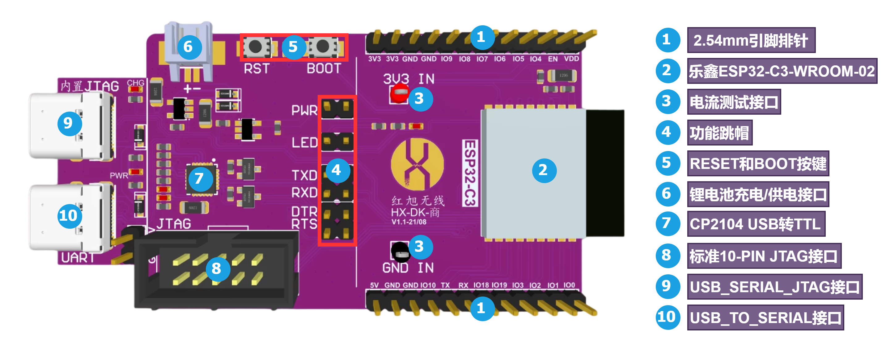

# 前言
该代码仓主要用于存放红旭无线ESP32C3开发板的硬件、软件、教程等相关的内容。

# 开发板简介
[HX-DK-商](https://item.taobao.com/item.htm?spm=a1z10.1-c-s.w4004-22286946226.12.7f292c2cfSNrZb&id=654877303965)，是红旭无线第二代无线通讯开发板，采用乐鑫ESP32-C系列的第一代产品ESP32-C3，其是一款安全稳定、低功耗、低成本的物联网芯片，搭载 RISC-V 32 位单核处理器 **（高达 160 MHz）**，同时 **支持`2.4 GHz Wi-Fi`，`全功能Bluetooth 5.0 (LE)`，`Bluetooth Mesh`，`WiFi Mesh`** 等协议，更多关于ESP32-C3的详情请参阅[乐鑫官网](https://www.espressif.com/zh-hans/products/socs/esp32-c3)。

[HX-DK-商](https://item.taobao.com/item.htm?spm=a1z10.1-c-s.w4004-22286946226.12.7f292c2cfSNrZb&id=654877303965)的概貌如上图所示，关于更多HX-DK-商的内容，请参阅红旭无线公众号的推文[【新品上市】HX-DK-商，支持WiFi+BLE5.0](https://mp.weixin.qq.com/s/7ETvlsvo3OYlM7oS1uCpLA)

# 资料
鉴于红旭无线上一代[HX-DK-夏](https://item.taobao.com/item.htm?spm=a230r.1.14.20.b5f04a28o0GC0A&id=608555326842&ns=1&abbucket=20#detail)的市场反馈，此次HX-DK-商开发板将采用全实战教程的方式，来阐述ESP32-C3的无线通讯的性能，并顺带讲解无线通讯过程中所使用到的ESP32-C3外设，如`UART`，`SPI`，`I2C`等等。同时，也鉴于目前市场上充斥着大量ESP32系列的WiFi教程，所以基于HX-DK-商的实战教程的优先级如下：
1. 低功耗蓝牙 $\color{red} {（高）} $
1. SIG MESH $\color{hotpink} {（中）} $
1. WiFi $\color{pink} {（低）} $

## 硬件
### 原理图
### PCB图
### 规格书
## 软件

## 教程
### BLE
#### 基础篇
1. [BLE基础知识](./Tutorials/Basic_Chapter/BLE基础知识.md)
1. [基于VSCODE的ESP32C3开发环境的搭建](./Tutorials/Basic_Chapter/基于VSCODE的ESP32C3开发环境的搭建.md)
1. [基于JTAG对ESP32-C3的调试及下载](./Tutorials/Basic_Chapter/基于JTAG对ESP32-C3的调试及下载.md)
1. [ESP32-C3启动流程详解](./Tutorials/Basic_Chapter/ESP32-C3启动流程详解.md)

#### 中级篇
#### 高级篇
#### 实战篇

### SIG MESH

### WiFi

# 关于我们
1. 技术交流论坛
    
    

    强烈建议在这个论坛上寻求帮助，我们可以免费为您解答相关的技术问题，**论坛里有大佬(24小时内回复!!!)**。

1. CSDN-博客

    

    相关的文字教程将映射至CSDN博客上，方便大家快速查阅。

1. 淘宝店铺

    

    对我们的硬件感兴趣的朋友，可以到上述的淘宝地址购买。
1. QQ群

    

    QQ群主要用于自主的技术以及行业信息交流，无广告纯技术探讨 **（仅限技术开发者加入，非技术人员请勿加入免得发现被踢）**。
1. 微信公众号

    

    不定期发布相关的技术动态消息或文章，也方便大家手机查看。
