# 前言
很多时候，对于BLE的开发者而言，有90%的时间会用在coding上，从而很容易忽视了BLE硬件相关的知识。小编在下键盘准备敲打内容的时候，在想 **“到底要不要花费时间在这占比很小的硬件部分？为什么BLE开发者都不太关心BLE硬件相关的内容？”**，既然大家能看到这篇文章，说明小编认为BLE的硬件还是必须要了解的；至于为啥多数人不关注BLE硬件相关的内容，这个跟目前国内的市场有很大的关系，多数国内的BLE产品可以说只要有蓝牙这个功能就行了，至于RF参数会不会超标、连接更远的距离、能不能过得了认证等等这些并不在考虑的范围内。然则，小编在网上经常看到有一部分或者大部分人会问一些在小编看来是很基础的问题，如**为什么BLE又掉线了？为什么我的BLE设备超过2米就连不上了？为什么我的BLE信号这么弱？为什么手机app找不到我的BLE设备了？**，倘若对BLE的硬件有更多的了解，当遇到这些问题时，则会更快地锁定问题，而不是拼命地去检查自己的代码。接下来，小编将结合自身的工作经验给大家阐述BLE相关的基础知识。
# 调制方式
众所周知，BLE是采用2GFSK-BT0.5的调制方式，这也是应用非常广泛的一种调制方式，如移动通信、航空与航海通信等诸多领域中均会使用到该调制方式；其中G是**Gauss Filter**的缩写，其作用就是用来限制信号的频谱宽度，所以GFSK的意思就是说：
> 当原始数字信号在经过FSK调变送出前，加上一个高斯低通滤波器来限制调变后的信号频谱宽度，使得在通讯上能限制频谱宽度的传输以及功率的消耗

而BT则是高斯滤波器的一个参数，其作用如下图所示：

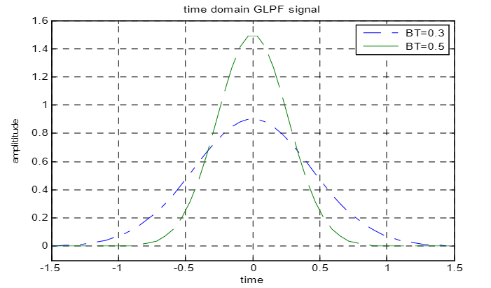

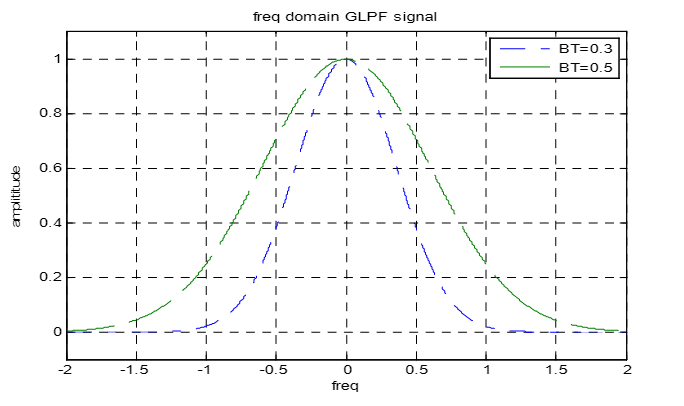

从上述的两幅图中可以看到，BT值越小，高斯低通滤波器信号在频域所占的带宽越窄，频谱利用率越高，相反时域的信号时延越长，对其他信号造成的干扰越大。所以为了减小码间串扰且拥有较高的频谱效率，低功耗蓝牙的BT选择为0.5；而这个时候读者们可能会如下几个疑问：
>1. 那2FSK在时域和频域又是怎么样的呢?
>1. BLE为什么要选择2GFSK，而不是2FSK？

首先，让我们先看一看2FSK在时域上的表现是怎么样的，如下图所示：
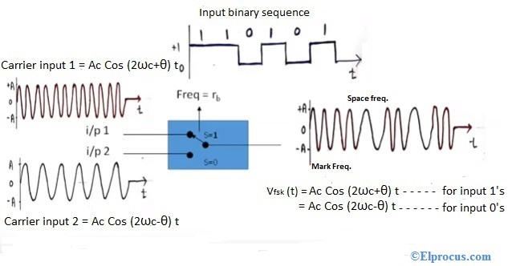

又是一堆熟悉而陌生的数学公式，是不是又到了后悔莫及的环节？当年要是多放点心思在学习上，而不是忙着去泡妞，也不至于现在妞跑了，知识也没有学习到的地步，哈哈。言归正传，既然时域是这样的，那么对应的频域又是什么样的体现形式，如下：

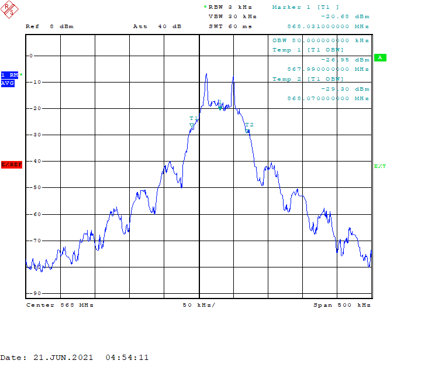

从上述2FSK在时域以及频域的表现形式看，就算我们对上述的公式不太了解，我们仍然可以得知2FSK的比特1和2FSK的比特0是通过不同的频率来表示的，而**BLE标准则规定基于中心频点的正频率偏差表示为1，负频率偏差表示为0（更多的详情，请参考蓝牙规范的Vol.6, Part A, Section 3.1）**；这里引入了一个频率偏差的概念，其含义如下：
> 调制波与载波的频率差为频率偏差，而正频率偏差，则表示调制波减去载波的频率差为正数，反之为负频率偏差

同时，BLE标准对频率偏差是有规定的，如下：
1. ≥185Khz@1Msym/s
1. ≥370Khz@2Msym/s

也许读者读到这里，仍然一头雾水，没有关系，接下来为了巩固上述的理解，这里小编举一个例子：
> 如果当前BLE工作在2402MHz这个频点，那么此时中心频点以及载波的频率就是2402MHz，现在BLE想在这个频点使用1M的PHY发送**01**两个比特的数据且频率偏差为200Khz，即比特1的频率就是2402MHz+0.2MHz，而比特0的频率就是2402MHz-0.2MHz，而对应的接收机收到这两个频点的信号，就知道对端设备传送的是**01**这两个比特的数据

看完这个例子之后，或许有部分读者仍然有如下的问题：
1. 如果频率偏差小于185KHz会怎么样？
  
    > 首先，频率偏差越小，对应的频谱密度效率就越高，但是会降低接收灵敏度，所以当BLE的信号的频率偏差小于185KHz，那么就会导致对端的设备无法解调此信号，从而造成通信失败
1. 如果频率偏差过大，如800KHz又会怎么样？

    > 如果频率偏差过大，那么频谱密度的效率就会降低，而且此时的BLE信号的占用宽带就会变大，根据卡森公式可知，2FSK调制方式的信号的理想占用宽带为：2x频率偏差+符号速率；如果使用了1Msps的符号速率，那么计算出来的占用宽带就是：2x800+1000 = 2600KHz = 2.6Mhz，而BLE标准规定40个信道且其之间的间距是2MHz，这就意味着不管工作在哪个信道，均会影响到其邻近信道的信号，虽然高斯滤波会限制最终的信号占用带宽，但是仍然有很大的概率会干扰到邻近的信道；这也是为什么当使用2M PHY时，邻近的信道会很容易受到干扰
1. 每一个BLE芯片厂商的频率偏差是一样的吗？

    > 各个芯片厂商根据自身芯片的工艺及芯片设计能力不同，而频率偏差也是各有差异，但是基本上必须符合下述的要求：
    > - 1Msym/s
    >  1. 当使用00001111测试序列时，平均频率偏差应符合**225 kHz ≤∆f1avg≤275 kHz**的范围
    >  1. 当使用10101010测试序列时，至少99.9%的最大频率偏差应**大于等于185Khz**
    > - 2Msym/s
    >  1. 当使用00001111测试序列时，平均频率偏差应符合**450 kHz ≤∆f1avg≤550 kHz**的范围
    >  1. 当使用10101010测试序列时，至少99.9%的最大频率偏差应**大于等于370Khz**
    
    > 更多的详情，请参考[BT RF-PHY测试规范](https://www.bluetooth.com/specifications/qualification-test-requirements/)

至此，我相信大部分读者此时应该明白2FSK是如何进行数据传送，以及频率偏差与数据之间的关系；接下来，让我们看看为什么BLE要选用2GFSK而不是2FSK，如下图所示：

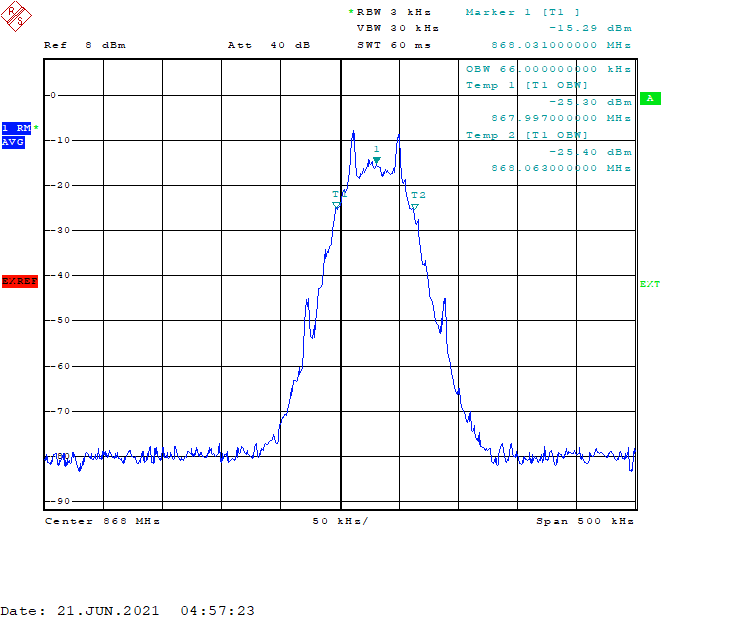

从上图可知，就调制信号而言，频域下的2GFSK比频域下的2FSK更加平滑，而且旁瓣杂散信号基本被过滤干净，同时信号占用带更窄了。但是，相较于2FSK调制而言，性能并没有因此恶化，基本不变，而且频谱密度效率还更高了。那既然这么叼，BLE毫无疑问肯定要选择2GFSK调制方式啊。
# 中心频点
众所周知，BLE的工作频道为2402~2480MHz，共有40个信道且信道之间的间隔为2MHz，即每个信道的中心频点与下一个邻近信道的中心频点的频率差为2MHz，如下图所示：

这也就是说2402~2480MHz指的是载波的频点，想要传送的数据是加载至载波信号之后再传送出去，结合上述的[调制方式](#调制方式)就很好理解了。所以，为了保证所有BLE的设备能正常的互相通信，BLE标准规定载波频率的偏差不要超过150KHz，那这意味着呢？这里小编举个例子：
> BLE芯片使用的是32MHz@50ppm的高速晶体，且工作在2402MHz下，那么32MHz倍频到2402MHz大约是75倍，这就意味着误差也放大了75倍，即50x32x75=120KHz；换句话说，32MHz@50ppm的高速晶体倍频到2402Mhz,实际的值是2402MHz ± 120KHz，这已经很接近150KHz的限制了；因此，我们经常可以在BLE芯片的规格书上，看到对高速晶体的要求的上限是**50ppm**

所以，如果出现BLE通讯异常或者掉线严重就要优先查看下是不是载波的频偏过大导致的。

# 通讯距离
小编在日常工作中经常听到或者网上看到有人问：**“你们的BLE模组或者你们的BLE芯片能做到多远的通讯距离？”**，类似的问题小编在年轻的时候也经常这样问代理商或者BLE芯片原厂的工程师，但是现在基本不问了，并不是说小编现在变叼了，而是这是一个需要综合考量的问题，它涉及到芯片的接收灵敏度、芯片的发射功率、天线的增益、电路板的布局以及测试的环境等等的因素，均会影响到最终的结果；接下来，小编将给大家阐述上述提及的这些关键因素对通讯距离的影响。

## 接收灵敏度
不管是BLE还是其他的通讯技术，接收灵敏度均是一个非常关键的指标，很大程度上决定了芯片能传多远；从专业的术语来解释的话，接收灵敏度就是对应的芯片能解调的最小的信号能量大小:
> 比如，某厂商的BLE芯片在1M PHY时的接收灵敏度为-97dBm，这就意味着当接收方的BLE芯片收到信号的能量大小为-97dBm时，它仍然能将这个信号解调出来；大家都知道，随着距离的增大，信号在空中传播的衰减就越大，从而接收方收到的信号能量就越小，而很小的能量BLE芯片都能解调，那就间接说明通讯距离就越远

用大白话来解释的话，接收灵敏度就类似于一个正常人的听力的敏捷度；如果一个人在别人说话很小声的时候，他仍然能听清别人说话，那说明这个人的听力很好，那也意味着他可以听到离他很远的人说话。

那么，上述说的-97dBm的信号都能被解调，是不是说-97dBm信号的内容被百分之百完全正解解调出来？答案显然是不是的，BLE标准对接收灵敏度的规定是这样的：

| 支持的最大载荷包长度（字节）        | 比特误码率（%）   |  
| --------   | -----:  | 
| 1 to 37     | 0.1 |   
| 38 to 63        |   0.064  |  
| 64 to 127        |    0.034    |  
| 128 to 255        |    0.017    |

基本上，BLE芯片厂商都会将0.1% BER的接收灵敏度写入到它们的规格书，即当BLE芯片接收到信号并统计出来的BER为0.1%或者PER为30.8%时，此时该信号能量大小就是该BLE芯片的接收灵敏度。那么，有读者可能会好奇它们之间是如何转换的，小编此时再次祭出数学公式：
> PER = 1- (1-BER)^(8*PayloadLength)

具体的计算如下图所示：

其中上述公式中的PayloadLength = Payload(37Bytes) + Header(2Bytes) + Access Address(4Bytes) + CRC(3Bytes) = 46Bytes，而MIC则是在使用BLE安全相关加密时才会有这个字段，这里没有采用安全相关的加密。所以，30.8% = 1-(1-0.1%)^(8*46)，这也就是说30.8%@PER转换为BER时，BER等于0.1%。

## 发射功率
这个也是大家见到过最多，也是最容易理解的一个概念。顾名思义，就是通过功率放大器将信号的能量放大，从而使得该信号在空中传播时，即使有衰减，但是对端设备仍然能收到较大的能量，这也间接导致通讯的距离增大；**这就好比一个人正常说话的时候，可能周边1-2米的人都可以听到，但是一旦这个人生气了，那么可能周边10-20米的人就可以听到他的声音了，所以不要随便生气，好好说话！**

## 环境
BLE设备工作的环境，同样对通讯的距离有很大的影响，这也是很多工程师最容易忽略的一个因素，大家可以想想这样的一个场景：
> 你女朋友在图书馆跟你说悄悄话，你听到了之后开心地跟吃了蜂蜜一样甜；但是，当你在KTV跟朋友们唱歌时，你女朋友同样对你说了句悄悄话，然后她就生气地跑了

上面就是一个典型的案例，当环境比较安静或者说没有什么其他干扰的时候，即使信号的能量很小 **（仍然大于芯片对应的接收灵敏度）**，对端设备都能接收并正确解调出来；但是，如果在一个干扰很大或者底噪很大的环境下，那么对端设备就不一定能接收并正确解调了，可能需要将信号提升到在底噪之上或者盖过干扰，对端设备才能接收并正确解调出来。这也是为什么有的时候同样的一个BLE设备在不同的地方，所体现出来的通讯距离不一样，就是这个原因；同时，在我们学习BLE基础知识的时候，也让广大读者们领悟了一个道理；**泡妞还是要选择一个安静的地方，原因你懂得！**

## 其他
至于PCB的布局以及天线的阻坑匹配，同样会影响到BLE的通讯距离，但是目前很多工作都可以在PCB厂完成，如50欧姆阻坑的走线，PCB厂商就可以帮你搞定，自然也就省去了后续的匹配。

## 神器
按照小编对目前国内工程师的了解，可能有部分的工程师就会骂小编：**你只会凑字数，BB这么久我还是不知道BLE设备最终能传多远，我想要最终的结果，其他的我并不想知道！！！**

对于这样的工程师，小编除了无奈而且还怒了，直接就把[神器](https://www.bluetooth.com/learn-about-bluetooth/key-attributes/range/#estimator
)甩到他脸上，然后一句话也不想说并且头也不回地就走了。而对于那些没有骂小编的工程师，让小编继续跟你讲解一下这个神器的厉害之处：
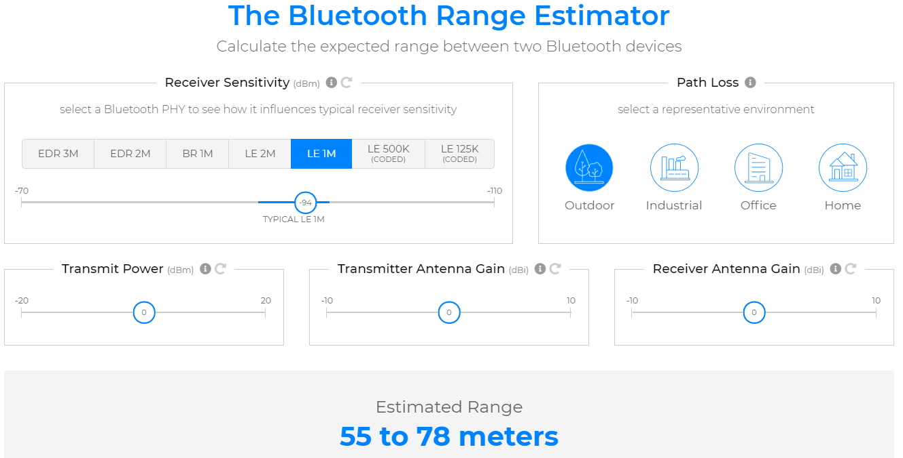

从上图可以看出，只需要根据自己的BLE设备情况，输入对应的参数即可快速评估出来大概的通讯距离。

# 功耗
相较于其他的无线通讯技术，低功耗蓝牙凭借极具竞争力的价格以及超低功耗的优势，占据了众多的市场领域。然而，大部分人的眼光却集中在了价格，往往忽略了BLE芯片的功耗；就算有部分人兼顾到功耗，却也只是**关注峰值电流，其实这就是资本家厉害的地方，强行给用户灌输不会错也不完全对的概念**，小编为什么会这么说呢？这里小编以欧美A，B厂商为例来佐证这一点：
- A厂商

    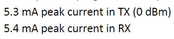

- B厂商

    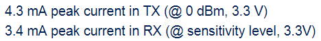

我们从上述的参数可知，**仅从峰值电流来看的话，B厂商比A厂商的功耗优秀，那这是不是意味着B厂商就比A厂商的功耗低呢？** 我们先不着急下结论，小编再让大家看一组数据：
- A厂商

    

- B厂商

    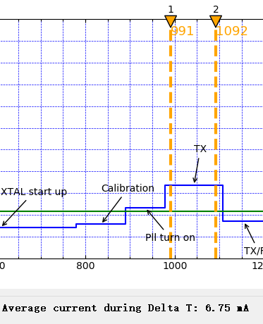

从上述的这组数据可知，**A厂商此时又比B厂商的功耗低了，是不是上述的结论又反转了？为什么这组数据会比上一组数据功耗高了？** 对于结论，我们仍然先不着急下结论，而对于功耗突然高了，这个小编先与大家掰扯掰扯：
> 之所以这组数据会比[上组数据](#first_group_data)大，主要的区别是上组数据显示的仅仅是Radio的功耗，而为了让Radio工作起来，还需要芯片内部其他元器件的配合，才能让Radio真正地工作起来；换句话说，功耗较大的这组数据是让一个Radio真正工作起来的功耗，并不是Radio单独的功耗

但是，对于整个BLE芯片的功耗而言，在只考虑BLE工作事件的前提下，功耗的高低主要取决于CPU、Radio、晶体起振时间、睡眠时的电流，而且评估整体的功耗还需要考虑工作的时长，例如：
> 芯片Ａ完成一次广播事件只需要5ms，而芯片Ｂ则仅需3ms；所以，**这个时候不能仅仅依靠峰值电流的大小来判断一个芯片功耗的高低**，此时功耗的大小取决于时间与电流的积分和

通过上述两组数据的对比，那么应如何评估BLE芯片的功耗呢？ **（BLE SoC的其他外设功耗可以直接从规格书获取得到，这里不细表）** 为了帮助读者正确评估BLE芯片的功耗，这里以下述的参数为例：
1. DC-DC模式，0dBm的发射功率，广播数据长度为31字节
1. 供电电压为3.3V，广播间隔为100ms，外部的低速晶体
1. 可连接不可扫描非定向广播，37、38、39三个广播信道，64MHz主频
1. 64KB RAM全保持

这里小编仍然以欧美A，B厂商为例，在相同的条件下，它们之间的功耗表现：
- A厂商
    

- B厂商

    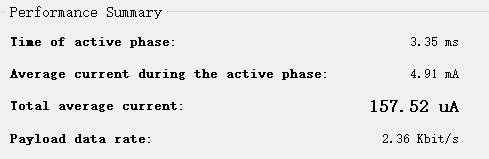

从上述的数据可以看出，此条件下A厂商还是远远优于B厂商，即使A厂商的Radio峰值电流大于B厂商。小编之所以兜兜转转，就是为了让读者们明白，**评估一个BLE SoC芯片的功耗并不能简单地只看规格书上的Radio峰值电流值，它是一个系统的工程，涉及到CPU、Radio、晶体起振时间、睡眠时的电流等方方面面**，希望看了这些内容之后，以后读者们对功耗的评估有一个更精准的判断。**当然，"情到深处"，小编也趁机插入一条软广，即对于BLE SoC功耗的精确评估，可以选购我们[旭选优品之一的低功耗电流分析仪](https://mp.weixin.qq.com/s?__biz=MzI3OTQ3Njg0Mg==&mid=2247487364&idx=1&sn=b2b9390ef7cb2ad4aee3782c5a0553fd&chksm=eb466081dc31e9979697da065d4682cd37a9f2bb74acc4dfd26bf462d2befd1e1acb1ee67d4f&scene=132#wechat_redirect)**

# 验证
众所周知，加入BLE队伍的芯片厂商越来越多了，从更大的格局来看，这也表明BLE的市场是受到大家所认可的，起码在未来的很长时间内，对BLE的人才需求还是很旺盛的，当然前提要是真的是人才；但是，从小的格局来看的话，这反而会加剧扰乱用户的判断，这是因为铺天盖地的各个厂商的信息以及它们所说的性能一个比一个强悍：
1. 一个方面，让用户觉得功能很强大，可以满足项目的需求，但实际跑下去发现，与实际相关甚远，浪费了大量的人力或者时间成本
1. 另外一方面，用户很容易会为自己不需要的功能而买单，导致成本上升

俗话说得好：**“销售的嘴，骗人的鬼”**，这里小编教大家一个方法，可以提前排雷，最后选择自己最适合的芯片；对BLE有过了解的读者，应该都看到过下面的这幅框图：

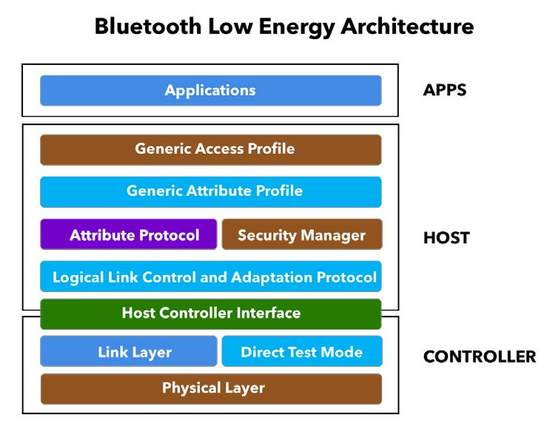

从上图我们可以很清楚地看到，整个BLE就是由**App、Host、Controller**三大部分组成，其中App就是大家所写的代码，而BLE协议栈则由Host和Controller这两部分组成，但是Controller层中的PHY层是纯硬件相关的，而BLE协议栈是纯软件的，所以平时我们口中所说的BLE协议栈是不包括物理层的；有了这样的一个概念之后，我们接下来再讲讲平时我们所说的蓝牙规范 **（截止目前为止，最新的是5.3版本）**，不同版本的规范，其所支持的特性均不一样的:
1. 有的对硬件有要求，需要升级PHY层，如2M PHY以及AoA/AoD
1. 有的仅仅是对Host层的内容进行升级
1. 有的仅仅升级了Controller层的内容
1. 有的新增的特性并不是强制的，也就是说不支持这个特性了可以认为是支持该版本的规范

因此，当某某厂商宣传它支持某某版本或者某某功能的时候，为了辨认真伪，我只需要关注以下三个点，接下来小编将以国内某厂商的最新的一颗BLE IC为例一一讲解：
1. 物理层的特性

    该厂商对外宣传其是支持全功能BLE 5.0，所以以下的BLE 5.0硬件特性应该是支持的：
    - 2M PHY
    - Coded PHY    

    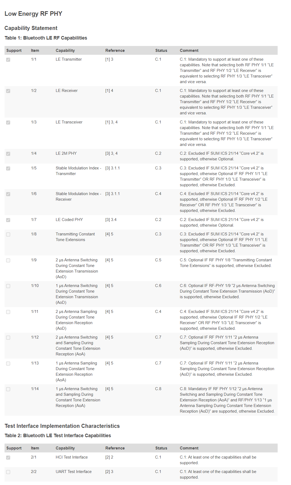

    从上图可知，物理层的确支持**2M & Coded PHY**，而且5.1的CTE也确实不支持
1. Host层

    

    从上图可知，PHY层的切换也是支持的，其是BLE 5.0的一项新特性
1. Controller层

    其中BLE 5.0的扩展广播则是软件相关的，它属于LL的内容，如下所示：
    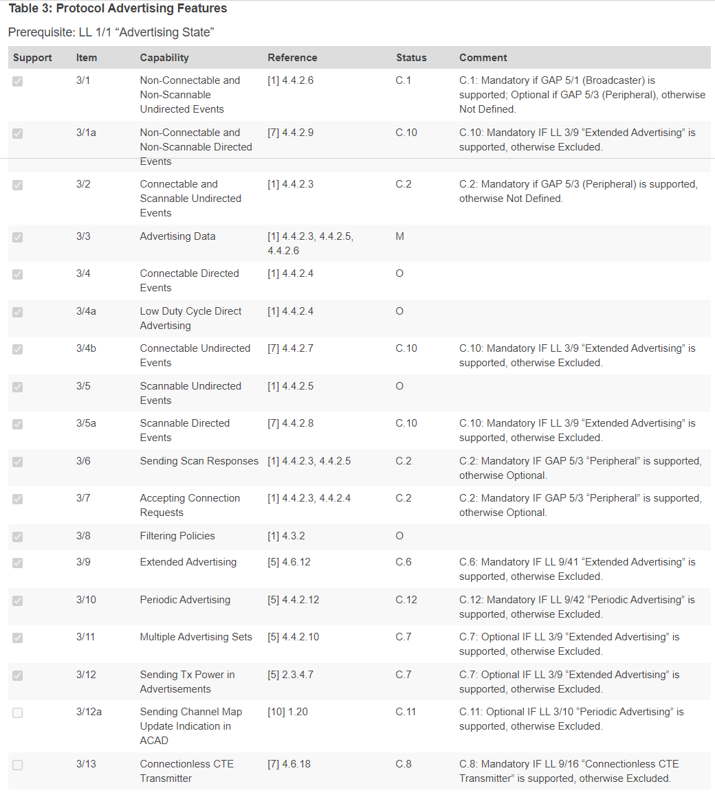

    从上图可以看出，扩展广播也是支持的，而且其他的可选特性也支持非常多，基本全支持除了5.1的特性之外。

以上的内容仅仅是举例说明，告诉大家如何辨别厂商所说的 **“功能”** 是否存在，通过小编查阅，该芯片也的确是达到厂商所宣传的全功能5.0的功能，但是未必所有厂商都是内外一致的，所以更多关于蓝牙不同版本的特性，请参阅对应的Spec，而上述图示的数据均从[蓝牙联盟官网](https://launchstudio.bluetooth.com/Listings/Search)获取。

至此，BLE的基础知识就讲解完成，以上的内容基本上覆盖了工作日常所需的90%了，剩下的请自行查阅Spec。

