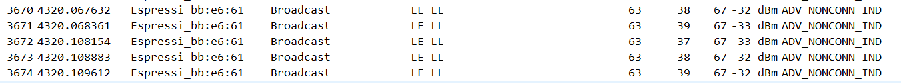
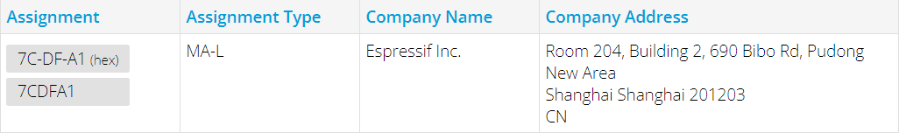
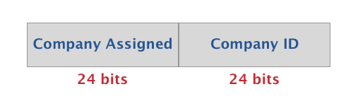
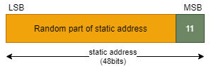

# 前言
在BLE领域中，地址是每个BLE设备不可或缺的重要组成部分，其就类似于我们日常的住宅地址，通过这个地址就可以找到并识别到这个BLE设备，否则周边这么多BLE设备就全乱套了；那么，BLE的地址又分为哪几种呢？

# 公共地址（Public Address）
BLE的公共地址，就类似于我们日常的身份证号码，是全球唯一的且不可改变的，不同的是：
1. 为了保证BLE公共地址的全球唯一性，其需要向[IEEE](https://standards.ieee.org/products-services/regauth/index.html)购买，然后IEEE组织就会对应地分配公共地址给买家；
1. 如果想要查询某BLE设备的公共地址是哪个厂商的，则可以点此[链接](https://regauth.standards.ieee.org/standards-ra-web/pub/view.html#registries)查询，如ESP32-C3的每个芯片都自带有一个公共地址：
    

    

1. 其是全球唯一的且在BLE设备的整个生命周期，都不会改变；
1. 总长度为6个字节，其组成结构如下图所示：
    

    - Company ID：IEEE分配的（最高有效位）
    - Company Assigned：公司内部分配的（最低有效位）

# 随机地址（Random Address）
除了公共地址类型之外，还有一个随机地址类型，其又分为**静态地址（Static Address）**和**私有地址（Private Address）**，它们之间主要通过最高的2位有效位来区分，具体如下所示：
## 静态地址（Static Address）
同样，其总长度也是48bits，但是最高的2位有效位是`0b11`，组成结构如下图所示：

  

该地址类型的主要特点如下：
1. 静态地址的随机部分至少有一个bit是0和1；
1. 用户在满足上述条件的情况下，可以自行配置BLE设备的静态地址；
1. 静态地址在上电之后，不可中途改变；
1. 只能在重新上电之后，才能改变静态地址的内容；
1. 如果BLE设备的静态地址改变了，那么如果对端设备存放了之前的静态地址，这就会导致重连旧的地址时失败；

## 私有地址（Private Address）
BLE的私有地址又分为**不可解析私有地址（Non-resolvable private address)** 和 **可解析私有地址（Resolvable private address）**，它们之间的主要区别如下：
### 不可解析私有地址（Non-resolvable private address)

### 可解析私有地址（Resolvable private address）
