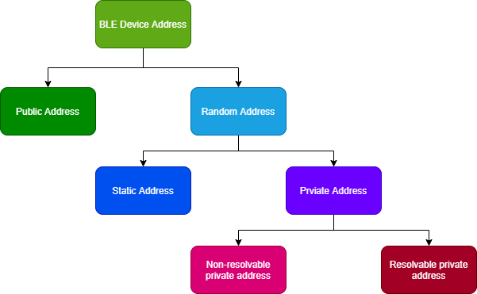
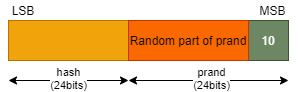
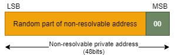

# 前言
在BLE领域中，地址是每个BLE设备不可或缺的重要组成部分，其就类似于我们日常的住宅地址，通过这个地址就可以找到并识别到这个BLE设备，否则周边这么多BLE设备就全乱套了；那么，BLE的地址又分为哪几种呢？

# 公共地址（Public Address）
BLE的公共地址，就类似于我们日常的身份证号码，是全球唯一的且不可改变的，不同的是：
1. 为了保证BLE公共地址的全球唯一性，其需要向[IEEE](https://standards.ieee.org/products-services/regauth/index.html)购买，然后IEEE组织就会对应地分配公共地址给买家；
1. 如果想要查询某BLE设备的公共地址是哪个厂商的，则可以点此[链接](https://regauth.standards.ieee.org/standards-ra-web/pub/view.html#registries)查询，如ESP32-C3的每个芯片都自带有一个公共地址：
    

    

1. 其是全球唯一的且在BLE设备的整个生命周期，都不会改变；
1. 总长度为6个字节，其组成结构如下图所示：
    
    

    - Company ID：IEEE分配的（最高有效位）
    - Company Assigned：公司内部分配的（最低有效位）

# 随机地址（Random Address）
除了公共地址类型之外，还有一个随机地址类型，其又分为**静态地址（Static Address）**和**私有地址（Private Address）**，它们之间主要通过最高的2位有效位来区分，具体如下所示：
## 静态地址（Static Address）
同样，其总长度也是48bits，但是最高的2位有效位是`0b11`，组成结构如下图所示：
  

该地址类型的主要特点如下：
1. 静态地址的随机部分至少有一个bit是0和1；
1. 用户在满足上述条件的情况下，可以自行配置BLE设备的静态地址；
1. 静态地址在上电之后，不可中途改变；
1. 只能在重新上电之后，才能改变静态地址的内容 **（非强制性，也可以不改变）**；
1. 如果BLE设备的静态地址改变了，那么如果对端设备存放了之前的静态地址，这就会导致重连旧的地址时失败；

## 私有地址（Private Address）
BLE的私有地址又分为**不可解析私有地址（Non-resolvable private address)** 和 **可解析私有地址（Resolvable private address）**，它们之间的主要区别如下：

### 可解析私有地址（Resolvable private address）
该类型的地址的长度大小同样为48bits，最高的2位有效位是`0b10`，其组成结构如下图所示：

该类型的地址所对应的特点如下：
1. 上图中显示的随机部分的内容至少有一个bit是0和1；
1. 该地址会周期性变化；

其中，`hash = ah(IRK, prand)`，prand则是设备本地随机产生的24bits数据，而IRK可以是在设备本地随机产生或者在设备生产时分配。
### 不可解析私有地址（Non-resolvable private address)
顾名思义，就是说该私有地址不可以被解析，其组成结构如下图所示：

同样，其总长度为48bits，但是最高的2位有效位是`0b00`，其对应的特点如下：
1. 随机部分的内容至少有一个bit是0和1；
1. 不可解析私有地址不能与公共地址相同；
1. 该地址会周期性变化；

# 总结
介绍完上述的不同类型的地址之后，我相信更多的人想知道如何使用这些类型的地址，或者说在什么场景下使用这些类型的地址。
## 公共地址（Public Address）
该类型的地址是全球唯一且固定的，理论上重复的概率基本为0，因为它们是由[IEEE组织](https://standards.ieee.org/products-services/regauth/index.html)分配给买家的，适用于为保证BLE设备地址的唯一性，方便其他人辩别。

## 静态地址（Static Address）
说句不好听的，该类型的地址就是方便各BLE设备生产商白嫖，因为这种类型的地址是免费的，不需要向IEEE组织购买，同时在一定范围内还能保证地址的唯一性，简而言之就是**免费＋有限的唯一性＝真香！**

## 可解析私有地址（Resolvable private address）
可解析私有地址的目的是防止恶意第三方跟踪蓝牙设备，同时仍允许一个或多个受信任方识别感兴趣的BLE设备。而可解析的意思就是说：
> BLE设备自身产生的IRK与受信任方分享之后，当受信任方的BLE设备接收到可解析私有地址，就会提取出`prand`值再与对端设备分享的`IRK`，进行**ah**计算得出一个`localHash`值，与可解析私有地址中的`hash`值进行比对，如果匹配上了那么对等设备的身份就已经解析。

## 不可解析私有地址（Non-resolvable private address)
相较于可解析私有地址，该类型的地址是不可解析的，所以这种类型的地址不太常用，但是有时会在一些Beacon的应用上使用。此类地址的唯一目的是防止任何其他 BLE 设备进行跟踪。

**最后，BLE设备的地址必须是公共地址或者静态地址，而不可解析和可解析地址是可选的。换句话说，即使使用了不可解析或者可解析地址，BLE设备还必须仍然存在公共地址或者静态地址，也就是此时BLE设备有两种类型的地址，因为不可解析和可解析地址仅用于解决隐私问题**