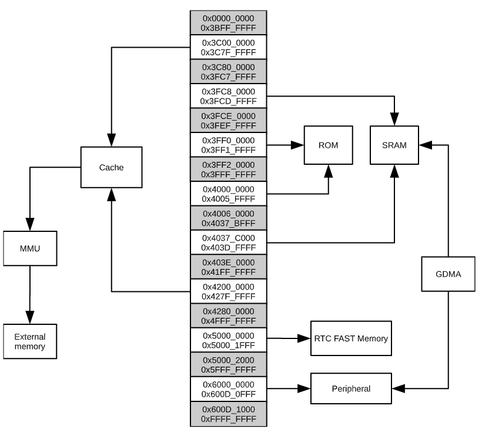
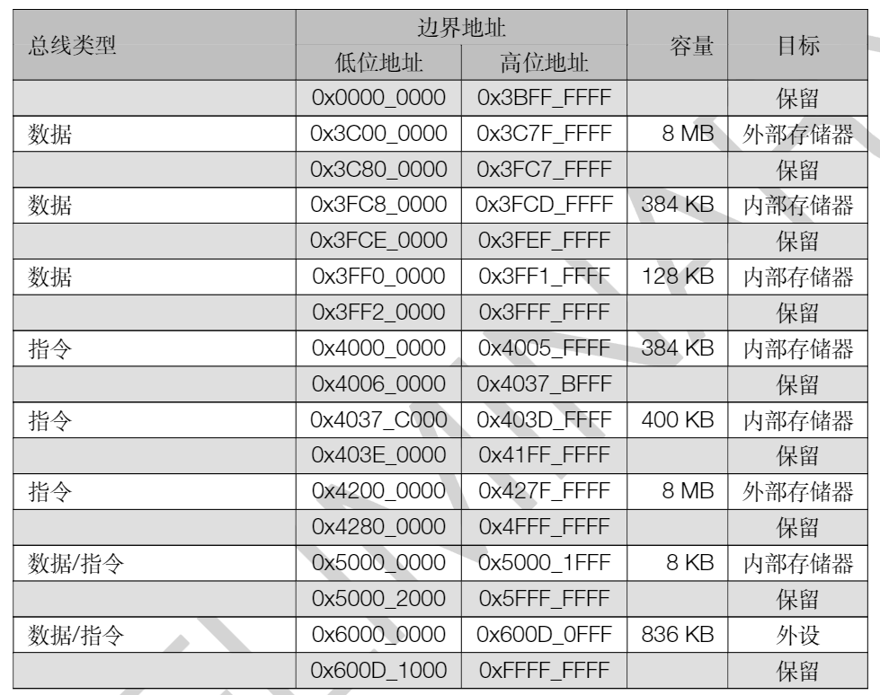
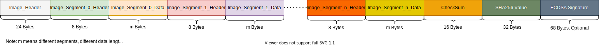
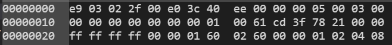
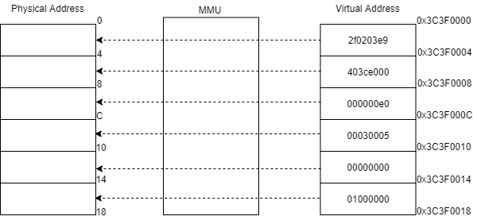
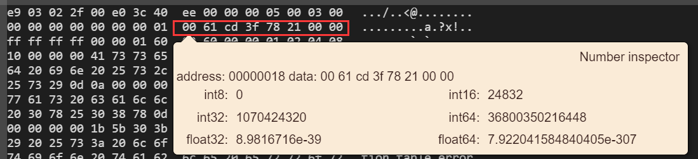
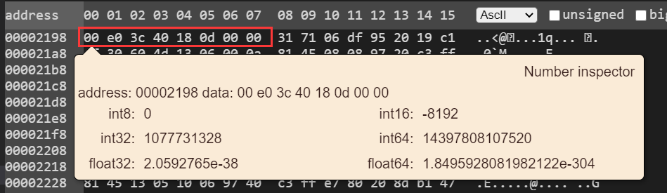
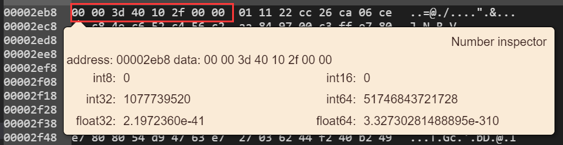
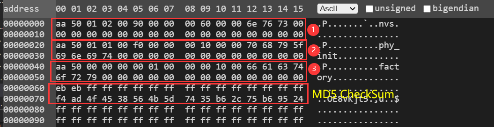
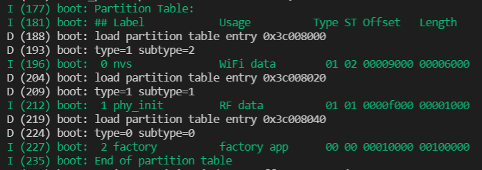

# 前言
不管是哪一种单片机，从上电开始到 **main()** 函数期间，其均会经历一段曲折的过程，最终才到来大家所熟悉的 **main()** 入口函数；当然，大部分人并不会关注或了解这个过程，因为就算完全弄懂了整个流程，用户最终能做的少之甚少或者压根不需要进行任何更改，直接开启代码之旅；然则，小编觉得这种对自身成长毫无益处的**快餐**编程思想，不应拾取；只有知彼知己，方能在你30岁之后百战百胜。虽说乐鑫官方也有出品[应用程序的启动流程](https://docs.espressif.com/projects/esp-idf/zh_CN/latest/esp32c3/api-guides/startup.html)，**为什么还要重复造轮子呢？** 我相信大家阅读完本篇文章，答案便会在心中，现在小编将一步一步地分析整个ESP32-C3的启动过程。**（如果对ESP32-C3启动流程不“感冒”的读者，可以自行跳过本文）**

# 背景知识
从规格书可知，ESP32-C3的片上存储包括：
- 384 KB的ROM：用于程序启动和内核功能调用
- 400 KB片上SRAM：用于数据和指令存储。400 KB中，有16 KB配置为cache专用
- RTC快速存储器：为8 KB的SRAM，可被主CPU访问，在Deep-sleep模式下可以保存数据
- 4 Kbit的eFuse：其中1792位保留给用户使用，例如用于存储密钥和设备ID
- 嵌入式flash：用于存放用户的编程代码

其中，ROM中的程序在芯片出厂时就已经固化了，用户无法进行修改，而且ROM中内嵌了一级Bootloader；所以，ESP32-C3上电后是从ROM中最开始运行的，在一级Bootloader中会加载二级Bootloader，紧接在二级Bootloader中加载用户的应用程序，最后启动应用程序。

这个时候有的读者会说：**“既然已经有了一级Bootloader，为什么还要多此一举再搞一个二级Bootloader?”** 针对这个问题，其实二级Bootloader也可以不需要 **（后续会出专文讲解，本文暂不讨论该应用场景）**，但是采用二级Bootloader有如下几个好处：

1. 便于固件升级，如空中升级
1. 便于固件回滚到之前的版本
1. 增加固件的安全性
1. 增加Flash分区的灵活性（使用分区表）

由于不同阶段会将不同的应用程序加载至ESP32-C3不同的内存区域，因此在细述各阶段的具体内容之前，应该先了解ESP32-C3的内存分布，如下所示：

<span id = memory_layout></span>

其中数据总线和指令总线的地址范围如下：



有了这些背景知识之后，小编将以官方的**Blink**示例工程为例，讲解这三个阶段分别做了哪些事情。

# 第一阶段，从ROM启动
如上述[背景知识](#背景知识)可知，ROM中的一级bootloader会从SPI Flash偏移量<code>0x00</code>处加载二级Bootloader，由于乐鑫官方并没有开放ROM的代码，所以用户无法查阅ROM是如何具体加载的二级Bootloader的；但是，我们仍然能从<span id = "log_information">开机的Log信息</span>中一窥端倪，如下所示：
```
ESP-ROM:esp32c3-api1-20210207
Build:Feb  7 2021
rst:0x1 (POWERON),boot:0xc (SPI_FAST_FLASH_BOOT)
SPIWP:0xee
mode:DIO, clock div:1
load:0x3fcd6100,len:0x2178
load:0x403ce000,len:0xd18
load:0x403d0000,len:0x2f10
entry 0x403ce000
```

从上述的片段信息，我们可以大概知道ROM将二级Bootloader分别加载至<code>0x3fcd6100</code>，<code>0x403ce000</code>，<code>0x403d0000</code>以及入口函数就在<code>0x403ce000</code>这个地址开始的地方；然而，是不是有读者会好奇 **“ROM是从哪里获取得到这些信息的，又是通过什么方式获取得到的？”** 在解答这个疑问之前，我们还需要先了解二级BootLoader的组成结构，对于ROM来说，它是不知道加载的是二级Bootloader还是其他特殊用途的程序，它统一认为是**应用程序**；因此，二级Bootloader的组成结构跟应用程序是一样的，如下图所示：



从上图可以看出，整个应用程序就是由上述的不同段组成，而想要获取应用程序的全部信息则是从<span id = "image_header"> **Image_Header** </span> 开始的，而Image_Header的内容又是由不同的字段组成，如下所示：
```c
/**
 * @brief Main header of binary image
 */
typedef struct {
  uint8_t magic;              /*!< Magic word ESP_IMAGE_HEADER_MAGIC */
  uint8_t segment_count;      /*!< Count of memory segments */
  uint8_t spi_mode;           /*!< flash read mode (esp_image_spi_mode_t as uint8_t) */
  uint8_t spi_speed: 4;       /*!< flash frequency (esp_image_spi_freq_t as uint8_t) */
  uint8_t spi_size: 4;        /*!< flash chip size (esp_image_flash_size_t as uint8_t) */
  uint32_t entry_addr;        /*!< Entry address */
  uint8_t wp_pin;            /*!< WP pin when SPI pins set via efuse (read by ROM bootloader,
                              * the IDF bootloader uses software to configure the WP
                              * pin and sets this field to 0xEE=disabled) */
  uint8_t spi_pin_drv[3];     /*!< Drive settings for the SPI flash pins (read by ROM bootloader) */
  esp_chip_id_t chip_id;      /*!< Chip identification number */
  uint8_t min_chip_rev;       /*!< Minimum chip revision supported by image */
  uint8_t reserved[8];       /*!< Reserved bytes in additional header space, currently unused */
  uint8_t hash_appended;      /*!< If 1, a SHA256 digest "simple hash" (of the entire image) is appended after the checksum.
                                * Included in image length. This digest
                                * is separate to secure boot and only used for detecting corruption.
                                * For secure boot signed images, the signature
                                * is appended after this (and the simple hash is included in the signed data). */
} __attribute__((packed))  esp_image_header_t;
```
其中，上述字段的含义如下所示：
- magic

  该值固定为0xE9，用于ROM识别出当前要加载的是应用程序

- <span id ="segment_count">segment_count</span>

  表示应用程序由多少个segment组成

- spi_mode

  表示访问SPI Flash时的SPI模式，取值如下所示：

  ```c
  /**
  * @brief SPI flash mode, used in esp_image_header_t
  */
  typedef enum {
    ESP_IMAGE_SPI_MODE_QIO,         /*!< SPI mode QIO */
    ESP_IMAGE_SPI_MODE_QOUT,        /*!< SPI mode QOUT */
    ESP_IMAGE_SPI_MODE_DIO,         /*!< SPI mode DIO */
    ESP_IMAGE_SPI_MODE_DOUT,        /*!< SPI mode DOUT */
    ESP_IMAGE_SPI_MODE_FAST_READ,   /*!< SPI mode FAST_READ */
    ESP_IMAGE_SPI_MODE_SLOW_READ    /*!< SPI mode SLOW_READ */
  } esp_image_spi_mode_t;

  ```
  至于，它们之间的区别这里不再细述，官方的解释已经非常清楚了，详情请查阅[SPI Flash Modes
](https://github.com/espressif/esptool/wiki/SPI-Flash-Modes)

- spi_speed

  表示访问SPI Flash的速率，但该字段仅占4bits，其取值如下所示：
  ```c
  /**
  * @brief SPI flash clock frequency
  */
  typedef enum {
    ESP_IMAGE_SPI_SPEED_40M,        /*!< SPI clock frequency 40 MHz */
    ESP_IMAGE_SPI_SPEED_26M,        /*!< SPI clock frequency 26 MHz */
    ESP_IMAGE_SPI_SPEED_20M,        /*!< SPI clock frequency 20 MHz */
    ESP_IMAGE_SPI_SPEED_80M = 0xF   /*!< SPI clock frequency 80 MHz */
  } esp_image_spi_freq_t;
  ```

- spi_size

  表示SPI Flash的空间大小，但该字段仅占4bits，其取值如下所示：
  ```c
  /**
  * @brief Supported SPI flash sizes
  */
  typedef enum {
    ESP_IMAGE_FLASH_SIZE_1MB = 0,   /*!< SPI flash size 1 MB */
    ESP_IMAGE_FLASH_SIZE_2MB,       /*!< SPI flash size 2 MB */
    ESP_IMAGE_FLASH_SIZE_4MB,       /*!< SPI flash size 4 MB */
    ESP_IMAGE_FLASH_SIZE_8MB,       /*!< SPI flash size 8 MB */
    ESP_IMAGE_FLASH_SIZE_16MB,      /*!< SPI flash size 16 MB */
    ESP_IMAGE_FLASH_SIZE_MAX        /*!< SPI flash size MAX */
  } esp_image_flash_size_t;
  ```

- entry_addr

  入口函数，也就是说从SPI Flash加载应用程序之后，跳转的入口函数地址

- wp_pin

  表示配置SPI Flash写保护的引脚是哪个，0xEE表示不使能写保护的功能

- spi_pin_drv

  配置SPI Flash引脚的驱动

- chip_id

  表示芯片的识别码，取值如下所示：
  ```c
  /**
  * @brief ESP chip ID
  *
  */
  typedef enum {
    ESP_CHIP_ID_ESP32 = 0x0000,  /*!< chip ID: ESP32 */
    ESP_CHIP_ID_ESP32S2 = 0x0002,  /*!< chip ID: ESP32-S2 */
    ESP_CHIP_ID_ESP32C3 = 0x0005, /*!< chip ID: ESP32-C3 */
    ESP_CHIP_ID_ESP32S3 = 0x0006, /*!< chip ID: ESP32-S3 */
    ESP_CHIP_ID_INVALID = 0xFFFF /*!< Invalid chip ID (we defined it to make sure the esp_chip_id_t is 2 bytes size) */
  } __attribute__((packed)) esp_chip_id_t;
  ```

- min_chip_rev

  表示当前应用程序所支持的最小芯片版本

- reserved

  保留以后使用

- <span id = "hash_appended">hash_appended</span>

  表示是否将SHA256值附加在应用程序校验码之后，取值如下：
  - 1，附加
  - 0，不附加

从上述的内容可以看出，ROM从二级Bootloader的前面24字节中获取了诸多关键的信息，然而为了将剩余的内容继续加载完成，只需要 **[segment_count](#segment_count)** 的内容即可，其余的内容均用于其他的目的，如：固件完整性验证、安全认证等等。

## <span id ="boot_header_info">获取二级Boot的头部信息</span>
那么，这个时候可能有读者会问 **“ROM是通过什么方式获取二级Bootloader前面24字节的内容的？”** 针对这个问题，小编其实在[背景知识->ESP32-C3内存分布](#memory_layout)中就埋下了答案，**即通过Cache MMU的方式将SPI Flash的内容映射到ESP32-C3的地址空间，然后通过访问ESP32-C3的地址空间，就可以间接地读取到SPI Flash的内容了**；这样的描述或许有些抽象，但是在开始举例之前，仍然有个知识点需要知道，即:
> 通过高速缓存，ESP32-C3系列一次最多可以同时有：
> - 8 MB的指令空间以64 KB的块映射到flash，支持8位、16位和32位读取。
> - 8 MB的数据空间以64 KB的块映射到flash，支持8位、16位和32位读取。

接下来我们可以先看看默认的二级Bootloader的内容 **(前面24字节的内容)** 是什么:



至于上图中内容所表达的含义，请在[image_header](#image_header)中一一对应；为了与官方统一口径，这里小编将SPI Flash的地址称为**物理地址**，而ESP32-C3的地址空间称之为**虚拟地址**，具体映射关系如下所示：

<span id = "cache_mmu_mapping"></span>

由上图可知，只要访问虚拟地址<code>0x3C3F0000</code>开始的24字节，即可获取得到二级Bootloader前面24字节的内容；同时，由上述可知，MMU最小的映射单位就是64KB，所以用户也可以通过访问虚拟地址<code>0x3C3F0000</code>开始的64K字节的内容，从而获取SPI Flash从0x00开始的64KB数据，但此时ROM它还暂时用不上这些剩余的数据。除此之外，小编还是需要强调一下，目前乐鑫官方对Cache MMU映射的地址进行了划分，如下所示：
- 0x3C000000~0x3C3F0000-1，用于Bootloader将虚拟地址映射至物理地址
- 0x3C3F0000~0x3C400000-1，用于Bootloader读取应用程序的前面24字节的内容

至此，ROM已经知道加载的二级Bootloader共有多少个segment，接下来就是获取segment的内容了。

## 获取二级Boot的具体内容
在讲解获取segment内容之前，我们先看看segment的组成结构，如下所示：
```c
/**
 * @brief Header of binary image segment
 */
typedef struct {
  uint32_t load_addr;     /*!< Address of segment */
  uint32_t data_len;      /*!< Length of data */
} esp_image_segment_header_t;

```

从上述的结构体可知，基本上是一个加载地址以及对应的数据长度，这时二级bootloader的整个组成结构就已经很清晰了。由上述可知，二级Bootloader共有3个segment，如下所示：
- segment1

    

  24字节之后，紧接着就是第一个segment的加载地址<code>0x3fcd6100</code>以及其对应的数据长度<code>0x00002178</code>
- segment2

  由segment1可知，在SPI Flash偏移量<code>0x2198=0x18+0x08+0x2178</code>处就可以获取第二个segment的加载地址<code>0x403ce000</code>
  以及其对应的数据长度<code>0x00000d18</code>

    

- segment3

  同理，第三个segment的加载地址为<code>0x403d0000</code>
  以及其对应的数据长度<code>0x00002f10</code>

    

通过上述的方式，ROM分别获取得到了各个segment的加载地址以及其对应的数据长度，我们此时可以清楚地看到它们分别与前面提及到的[开机log信息](#log_information)一一对应。

那么，问题又来了 **“怎么利用这些信息，从而将数据加载至SRAM中呢？”** 针对这个问题，关键的地方在于 **加载地址** 这个参数；从上面获取得到的信息可知，三个segment的加载地址分别为<code>0x3fcd6100</code>、<code>0x403ce000</code>、<code>0x403d0000</code>，结合[背景知识->ESP32-C3内存分布](#memory_layout)可知，这三个加载地址均处于内部存储器（SRAM）的范畴，所以这些数据均会加载至SRAM中。

然而，它们并不能通过Cache MMU直接映射至SRAM中，如小编前面所述，Cache MMU仅仅是将虚拟地址映射至物理地址，而且此时虚拟地址的范围为上述提及的**0x3C000000~0x3C3F0000-1**，所以想要将这些数据加载至SRAM，仍然需要通过Cache MMU将这些内容先映射至虚拟地址 **(参考[Cache MMU映射](#cache_mmu_mapping))** ，然后访问虚拟地址获取得到数据，再将其分别赋值至从segment加载地址开始的地方，如下所示：

```c
for (size_t i = 0; i < data_len; i += 4) {
    int w_i = i / 4; // Word index
    uint32_t w = src[w_i];
    if (checksum != NULL) {
        *checksum ^= w;
    }
#ifdef BOOTLOADER_BUILD
    if (do_load) {
        dest[w_i] = w ^ ((w_i & 1) ? ram_obfs_value[0] : ram_obfs_value[1]);
    }
#endif
    // SHA_CHUNK determined experimentally as the optimum size
    // to call bootloader_sha256_data() with. This is a bit
    // counter-intuitive, but it's ~3ms better than using the
    // SHA256 block size.
    const size_t SHA_CHUNK = 1024;
    if (sha_handle != NULL && i % SHA_CHUNK == 0) {
        bootloader_sha256_data(sha_handle, &src[w_i],
                                MIN(SHA_CHUNK, data_len - i));
    }
}
```

其中**dest**就是segment的加载地址，而**src**就是映射后的虚拟地址。ROM就是按照上述的方法将segment的内容一一映射并赋值至其对应的加载地址，最后跳转至<code>0x403ce000</code>这个入口地址。

另外一点需要额外强调的是，如果获取得到的segment加载地址处于[背景知识->ESP32-C3内存分布](#memory_layout)的外部存储器，那么这时只需要使用Cache MMU映射即可；在需要取数据时，只要访问虚拟地址就可以了。

至此，小编相信读者们已经完全明白ROM是如何加载二级Boot整个过程了。
# 第二阶段，加载分区表&应用程序
当ROM加载完二级Boot之后，就会跳转至<code>0x403ce000</code>这个入口函数，我们可以通过bootloader的map文件获取得到这个地址的入口函数：

```c
 .text.call_start_cpu0
    0x00000000403ce000       0x60 esp-idf/main/libmain.a(bootloader_start.c.obj)
    0x00000000403ce000                call_start_cpu0
```                

从上述可知，ROM加载完二级Boot会跳转至<code>call_start_cpu0</code>这个函数，而该函数除了一些常规的硬件初始化之外，首要任务就是加载位于SPI Flash偏移量<code>0x8000</code> **（默认值，可以修改）** 处的分区表内容，最后才是用户编写的应用程序。还是老规矩，让我们先看看分区表的组成结构吧，如下所示：
```c
/* Structure which describes the layout of partition table entry.
 * See docs/partition_tables.rst for more information about individual fields.
 */
typedef struct {
    uint16_t magic;
    uint8_t  type;
    uint8_t  subtype;
    esp_partition_pos_t pos;
    uint8_t  label[16];
    uint32_t flags;
} esp_partition_info_t;

```
上述各个字段的函数如下：
- magic

  该值固定为0x50AA，用于标识接下来是分区表的内容

- type

  表示该分区的类型，取值如下所示：
  - 0x00，应用分区
  - 0x01，数据分区  
  - 0xFF，任意类型的分区

- subtype

  表示分区子类型，取值如下：
  - 应用分区
    - 0x00，出厂应用程序
    - 0x10~0x1F，OTA应用程序，最多允许存在16个OTA应用程序
    - 0x20，测试目的的应用程序
  - 数据分区
    - 0x00，OTA选择分区
    - 0x01，PHY初始化数据分区
    - 0x02，NVS分区
    - 0x03，Codedump分区
    - 0x04，NVS Keys分区
    - 0x05，模拟 eFuse 位的分区
    - 0x80，ESPHTTPD分区
    - 0x81，FAT分区
    - 0x82，SPIFFS分区
    - 0xFF，任意类型的分区

- pos

  - offset，分区位于SPI Flash的位置
  - size，分区对应数据的长度

- label

  用于对分区进行任何有意义的命名，不要超过16字节的长度

- flags

  用于指示是否加密分区，取值如下：
  - 1，加密
  - 其他值，不加密

  但是，应用分区总会被加密，不管flags是多少

上述内容仅仅是一个分区的内容，ESP32-C3支持同时存在多个分区，如果存在多个分区，那么分区0/1/2/...的内容就会按顺序存放在SPI Flash偏移量<code>0x8000</code> **（默认值，可以修改）** 开始的地方，但是总长度不要超过**0xC00**，这也就意味着最多只能存放**96**个分区，但是全部分区的MD5校验和占了32个字节；因此，最终最多只能存放**95**个分区。

下面是默认的分区表内容：

   

 从上图可知，默认的分区表共有3个，分别与下述的log信息一一对应：
 
   

## 加载分区表
从上文的分析中，小编想信读者们对分区表的组成结构也已经相当了解了，由于小编在本文举例的分区表中并没有**data/ota**分区表类型，但是有**app/factory app**，所以二级bootloader加载完分区表之后，就会马上加载**factory app**；那么，可能读者会有这样的疑问：**二级bootloader最终到底从分区表获取了哪些信息呢？它又是如何获取得到分区表的内容呢？** 其实，第二个问题即获取分区表的内容，小编在上述[获取二级Boot的头部信息](#boot_header_info)就已经细述了，也就是说获取分区表的方式也是通过Cache MMU方式，将虚拟地址映射至物理地址；然而，由于分区表处于SPI Flash偏移量<code>0x8000</code> **（默认值，可以修改）** 开始的地方，远未达到最小映射单位64KB的大小，而且ROM此时已经完成二级Bootloader的映射了；所以，此次对分区表的映射仍然是从SPI Flash地址0x00开始，映射64KB的内容至虚拟地址**0x3C000000**开始的地方，而获取得到分区表内容之后，最终填充成如下的格式内容：
```c
typedef struct {
    esp_partition_pos_t ota_info;
    esp_partition_pos_t factory;
    esp_partition_pos_t test;
    esp_partition_pos_t ota[MAX_OTA_SLOTS];
    uint32_t app_count;
    uint32_t selected_subtype;
} bootloader_state_t;
```

由于本文侧重于如何加载分区表，所以关于分区表更多的详情，请查阅官方的[链接](https://docs.espressif.com/projects/esp-idf/en/latest/esp32c3/api-guides/partition-tables.html)。

## 加载应用程序
从上面的内容可以清楚地知道，二级Bootloader从分区表就是为了获取各个**app**和**ota**位于SPI Flash的位置以及对应的数据长度信息。紧接着，二级Bootloader就会从这些地址信息中，获取对应的应用程序的24字节头部信息，从而实现跳转至应用程序。至于二级Bootloader是如何加载应用程序的，其过程跟上述的[第一阶段，从ROM启动](#第一阶段，从ROM启动)是一模一样的，从**blink.bin** 和 **blink.map** 可知，二级bootloader加载完blink应用程序之后，跳转至<code>0x403802d2</code>这个入口函数，即
```c
 .iram1.37      0x00000000403802d2      0x178 esp-idf/esp_system/libesp_system.a(cpu_start.c.obj)
                0x00000000403802d2                call_start_cpu0
```                
# 第三阶段，启动应用程序
获取得到跳转地址并进入**call_start_cpu0** 之后，进行一序列的硬件以及系统相关的初始化，进入以下函数并启动一个main的任务，即
```c
void esp_startup_start_app(void)
{
    esp_startup_start_app_common();

    ESP_LOGI(TAG, "Starting scheduler.");
    vTaskStartScheduler();
}
```
最后才跳转到blink的示例工程中的 **app_main()** 函数；至此，ESP32-C3芯片从上电到运行至app_main()的整个过程就分析完毕了。