# 前言
众所周知，没有哪个工程师不被国内半导体厂商芯片的开发环境，折腾地死去活来的：
1. 要么核心技术在国外，导致下载的进度条根本不会动
1. 要么就是明明按照操作手册来，但是一编译就N多个错误
1. 要么安装的过程中又缺失某个文件，但官方的步骤中又没有提及
1. 要么提供的文档内容前后矛盾，让人看了之后一脸懵逼
1. 要全部写下来这些遭遇，小编可以围绕这个主题轻松写下一篇**1000**字以上的论文

因此，小编在这里用**极其微弱的声音**呼吁，要想国货当自强，能不能花点人力先将最简单的开发环境弄**成熟**、**好用**、**方便**、**稳定**，又或者**扶持第三方的团队一起把这方面的内容做得更加本地化，更加完善**，而不是一味地去拼杀价格！！！因为现在 **国产芯片 = 廉价**的印象已经深深地烙在广大工程师的脑海里，更不要让想支持国货的企业或者工程师，还没开始就结束了。


# 准备工作
目前ESP32-C3是乐鑫今年新推出的一款 WiFI&BLE 5.0 SoC芯片，要想实现ESP32C3的`代码编辑`、`程序编译`、`固件烧写`以及`软件的功能调试仿真`。

虽然乐鑫官方以及第三方推出了多种多样的搭建方式，也大大地提高了灵活性，但是由于可择性太多，往往起到适得其反的作用，导致新人不知所措；同时，官方及第三方的环境搭建文章存在一定的滞后性，导致提及的一些方法由于工具的升级而失效，间接导致环境搭建失败；一方面，这样会导致大量的人力浪费；另一方面，也非常不利于小白入门。

小编的观点是：**在搭建开发环境方面，只需要强推一种支持跨平台的方式即可，而代码层面的实现方式可以多种多样**。鉴于这样思想的影响，红旭无线后续将基于**VSCODE + Espressif IDF插件**的组合，出品所有的ESP32C3教程 **（包括代码和文字）**；那么，该组合所需安装的工具<font size=5> **(请务必先阅读[开发环境搭建](#开发环境搭建)再决定下载下述的哪些工具软件)**</font>，具体如下所示：
1. [Visual Studio Code](https://code.visualstudio.com/)
1. Espressif IDF
    
    该插件在VS Code的插件市场中输入<code>Espressif IDF</code>，便可以直接下载；其出自于乐鑫官方之手，大大方便了工程师基于乐鑫芯片的开发；小编在写这篇文章时，该插件的版本为v0.6.1，如果后续有新的版本则使用最新的版本；

    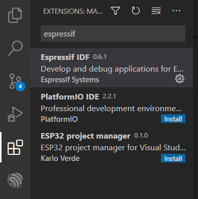
1. <span id="Python">[Python](https://www.python.org/getit/)</span>

    乐鑫SDK的编译、烧录以及调试均大量使用了Python脚本，这就需要安装Python，否则SDK将无法使用；这里需要注意的是：<font size=5>**在安装Python时需要将路径添加至系统的环境变量的选项打勾**</font>；

1. <span id="Git">[Git](https://git-scm.com/downloads)</span>

    用于下载乐鑫的SDK以及对应的工具，同时它也是一个很好版本管理以及协同合作的工具，安装最新版本的即可；

1. <span id="ESP-IDF-Tools">[ESP-IDF Tools Installer](https://docs.espressif.com/projects/esp-idf/en/latest/esp32/get-started/windows-setup.html#get-started-windows-tools-installer)</span>

    这个工具会安装<code>交叉编译器</code>、<code>OpenOCD</code>、<code>CMake</code>、<code>Ninja构建工具</code>，同时还可以下载<code>Python</code>、<code>Git For Windows</code>以及<code>ESP-IDF SDK</code>；如果选择这个工具，则上述的[Python](#Python)和[Git](#Git)则不用单独下载安装，这个工具可以帮你下载安装；同样的，在安装过程中要将<font size=5>**ESP-IDF Tools的路径添加至系统环境变量的勾选选中**</font>；

1. [Microsoft Visual C++ Build Tools](https://visualstudio.microsoft.com/downloads/)

    如果安装相关软件时，出现下述错误：
    > error: Microsoft Visual C++ 14.0 is required. 

    这个时候就需要安装这个软件，否则不需要；

    


# 开发环境搭建
## 下载SDK
目前乐鑫官方有Github以及Gitee两个地方供用户下载SDK，除此之外，小编不推荐其他任何地方下载SDK：
- <span id="Github">GitHub</span>

  在任何你想要存放SDK的位置，**单击鼠标右键并选中Git Bash Here（前提是已经安装了Git工具）**，

  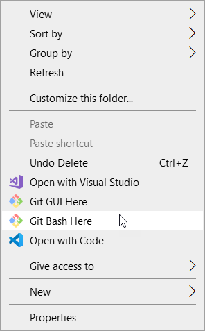

  然后键入如下命令：

  - 下载最新版本
      > git clone --recursive https://github.com/espressif/esp-idf.git

  - 下载指定的稳定版本
      > git clone -b v4.2 --recursive https://github.com/espressif/esp-idf.git
      
      这里小编是仅以v4.2版本为例

  - 子模块更新
      
      下载完SDK之后，还需要对子模块进行更新；那么如何判断是否有子模块呢？我们可以在SDK目录查看是否有<code>.gitmodules</code>文件；如果有，则还需要键入以下命令：
      > git submodule update --init --recursive --progress
  
  - SDK更新

      该命令仅对从master分支下载的SDK有效，在当前SDK的路径下依次键入下述的命令：
      > git checkout master\
      git pull\
      git submodule update --init --recursive      

- Gitee

  跟上述的[Github](#Github)操作是一模一样的，只不过是将下载的地址换成如下的链接：
  > https://gitee.com/EspressifSystems/esp-idf.git

  对于Gitee而言，其子模块更新还需要下载一个工具，下载完SDK之后再次键入以下命令：
  > git clone https://gitee.com/EspressifSystems/esp-gitee-tools.git

  然后，再利用esp-gitee-tools文件夹中的<code>submodule-update.sh</code>进行子模块更新，具体的操作方式如下：
  - 方式一

      进入**esp-gitee-tools**目录，export submodule-update.sh 所在路径，方便后期使用，如：
      > cd esp-gitee-tools \
      export EGT_PATH=$(pwd)

      进入 esp-idf 目录执行 submodule-update.sh 脚本：
      > cd esp-idf \
      $EGT_PATH/submodule-update.sh

  - 方式二

      <code>submodule-update.sh</code>脚本支持将待更新 submodules 的工程路径作为参数传入，例如：<code>submodule-update.sh PATH_OF_PROJ</code>。
      
      假如下载的SDK位于 ~/git/esp32-sdk/esp-idf 目录，可使用以下方式来更新：

      > cd esp-gitee-tools \
      ./submodule-update.sh ~/git/esp32-sdk/esp-idf

  关于**submodule-update.sh**更多的详情，可以参考此[链接](https://gitee.com/EspressifSystems/esp-gitee-tools/blob/master/docs/README-submodule-update.md)

由于历史原因，有的工程师从Github拉取SDK会很慢 **（需要梯子）**，那么他就可以选择从Gitee拉取SDK。即便如此，小编仍然喜欢用Github下载SDK，因为上面的内容永远是最新的；如果有的读者没有梯子或者说找不到好的梯子，可以使用小编同款的 **[梯子](https://efanccyun.net/aff.php?aff=527)（付费的，稳定且便宜）**。

## 配置工具包
当将SDK下载下来之后，我们还需要下载对应的工具才能实现`编译`、`下载`以及`调试仿真`，而下载这些工具又有四种方式：
1. Github
    当我们从Github拉取完SDK之后，在Git Bash中依次键入如下命令：
    > cd esp-idf-c3 \
    ./install.sh \
    . ./export.sh 

1. Gitee
    同样的，在Gitee下载完SDK之后，在Git Bash中依次键入如下命令：
    > cd esp-idf-c3\
    ../esp-gitee-tools/install.sh \
    . ./export.sh

    关于**install.sh**更多的详情，可以参考此[链接](https://gitee.com/EspressifSystems/esp-gitee-tools/blob/master/docs/README-install.md)

1. <span id="ESP-IDF-Tools-Installer">ESP-IDF Tools Installer</span>**（小编推荐的方式）**

    这一种方式则比较方便，不需要输入什么命令，根据自身情况安装工具包以及下载对应的SDK即可；很适合小编这样的懒人，无脑安装即可，该安装包覆盖了SDK和所有的配置工具包；
    
    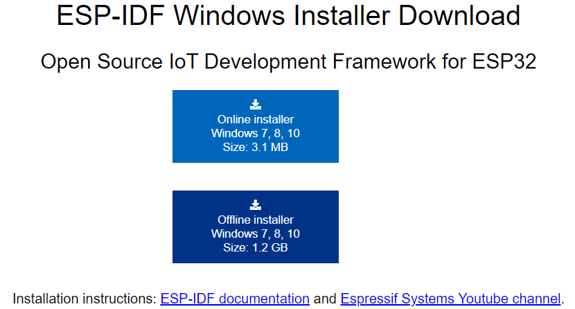

    至于，选择哪一个则取决于读者。

1. VSCODE中的Espressif IDF插件

    首次打开该插件时，它会弹出如下的对话框：

    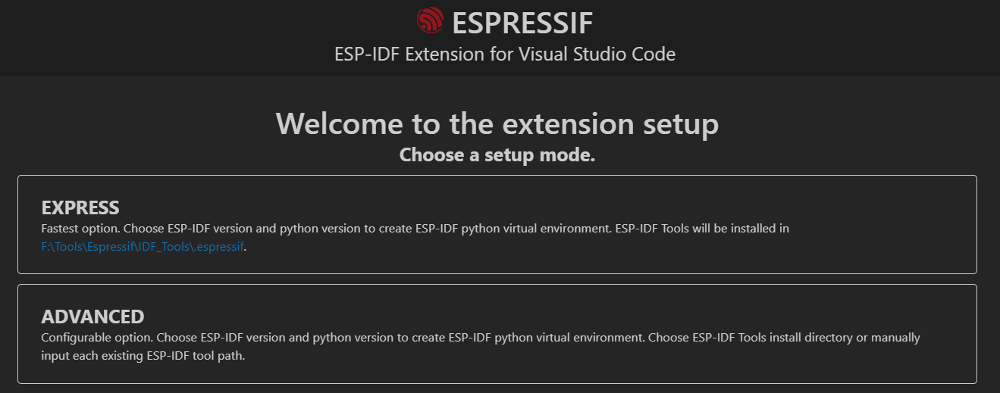

    如果上述的界面没有打开，则可以在VSCODE中先按下<code>F1</code>键，然后在弹出的对话框选择<code>ESP-IDF:Configure ESP-IDF extension</code>，这样可以手动打开上述的界面；至于选择哪一个选项，**EXPRESS**和**ADVANCED**哪一个都可以，只不过前者更倾向于还没有下载SDK，而后者则用于已经下载了相应的SDK；该插件跟上述[ESP-IDF Tools Installer](#ESP-IDF-Tools-Installer)的功能是一模一样的，只不过**Espressif IDF插件**不能选择配置工具安装在指定的目录下，而**ESP-IDF Tools Installer**则可以指定安装在哪个路径下；同时该插件是从Github中拉取配置工具的，如果没有梯子的话，**可能要下载一到两个小时**，但是等所有的工具或者SDK下载完成之后，就马上可以在VSCODE进行开发了，这也是有别于**ESP-IDF Tools Installer**的地方；

对于上述的四种方式，小编这里更加推荐大家采用[ESP-IDF Tools Installer](#ESP-IDF-Tools)的方式来下载并安装配置工具，但是在采用该方法下载安装之前，我们需要将配置工具包的源切换到国内的阿里云 **（我们需要提前已经安装好Python以及pip）**，在Git Bash键入如下命令：
> pip config set global.index-url http://mirrors.aliyun.com/pypi/simple \
pip config set global.trusted-host mirrors.aliyun.com

<sapn id="上面">如果操作正确，那么配置工具包很快就会被安装下载到你指定的目录下:

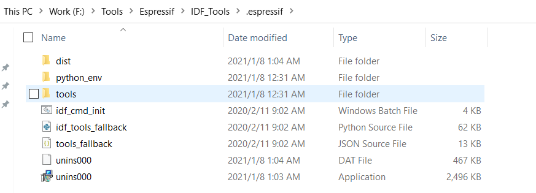 

同样桌面上也会多一个 **ESP-IDF Command Prompt (cmd.exe)** 或者 **ESP-IDF x.x PowerShell** 的快捷键 **（仅ESP-IDF Tools Installer这一方式才有这一类型的快捷键）**，具体如下所示：</span>

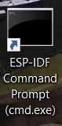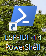

## Espressif IDF插件配置
除了Espressif IDF插件之外，其他上述的三种方式在下载完配置工具包和SDK之后，均要对Espressif IDF插件进行配置之后，才可以在VSCODE中完美开发ESP32C3；主要需要修改的地方如下：

- idf.adapterTargetName

  该参数主要配置目标设备，如<code>esp32</code>、<code>esp32s2</code>、<code>esp32c3</code>、<code>esp32s3</code>；但是，目前Espressif IDF v0.6.1插件只支持<code>esp32</code>和<code>esp32s2</code> **（后续新版本应该会直接支持）**，所以我们需要在代码工程中的<code>settings.json</code>指定这个目标设备，以下是小编的配置：

  ```json
  "idf.adapterTargetName": "esp32c3",
  ```
- idf.customExtraPaths

  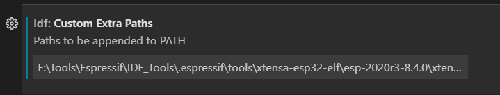
  
  该参数主要是在VSCODE中，提前将上述安装的各个配置工具包的路径添加到系统环境变量**PATH**，当然你可以直接将各个配置工具包的路径，分别添加到你电脑的系统环境变量**PATH**上，只不过Espressif IDF插件在执行相关的操作时，是优先调用<code>idf.customExtraPaths</code>中的内容；那么，应该如何填充这些内容呢？在填充之前，我们要提前知道配套工具包的内容有哪些，而这些内容我们可以在`$IDF_PATH/tools/tools.json`中找到，其中<code>$IDF_PATH</code>表示SDK的路径，以下是小编的路径：

    > F:\BLE_WIFI\Espressif\SDK\esp-idf-c3\tools\tools.json

  那么，知道了有哪些工具之后，我们就将这些工具的路径填充到<code>idf.customExtraPaths</code>，以下是小编配置工具包的路径内容 **（请勿直接复制下述内容，其仅表示当前小编的工具包路径，后续应随着工具的升级而做出相应的修改）**：

  ```
  F:\BLE_WIFI\Espressif\SDK\esp-idf\components\esptool_py\esptool;F:\BLE_WIFI\Espressif\SDK\esp-idf\components\app_update;F:\BLE_WIFI\Espressif\SDK\esp-idf\components\espcoredump;F:\BLE_WIFI\Espressif\SDK\esp-idf\components\partition_table;F:\Tools\Espressif\IDF_Tools\.espressif\tools\riscv32-esp-elf\esp-2021r1-8.4.0\riscv32-esp-elf\bin;F:\Tools\Espressif\IDF_Tools\.espressif\tools\cmake\3.20.3\bin;F:\Tools\Espressif\IDF_Tools\.espressif\tools\openocd-esp32\v0.10.0-esp32-20210902\openocd-esp32\bin;F:\Tools\Espressif\IDF_Tools\.espressif\tools\ninja\1.10.2\;F:\Tools\Espressif\IDF_Tools\.espressif\tools\idf-exe\1.0.1\;F:\Tools\Espressif\IDF_Tools\.espressif\tools\ccache\4.3\ccache-4.3-windows-64;F:\BLE_WIFI\Espressif\SDK\esp-idf\tools
  ```

  可能大家觉得上述的路径一个一个找会很慢而且麻烦，有没有办法一键获取所有的配置工具包的路径呢？**答案当然是有的！！！**
  
  

  不知道大家还记不记得小编在[上面](#上面)提到，当**ESP-IDF Tools Installer**安装完成之后，桌面上会多一个 **ESP-IDF Command Prompt (cmd.exe)** 或者 **ESP-IDF x.x PowerShell** 的快捷键；所以，只要单击这个快捷键之后，就可以将上述的路径复制下来，填充到<code>idf.customExtraPaths</code>中去；
  
  

  当填充完成之后，再打开全局的`Setting`，看看格式符不符合JSON格式：
  
  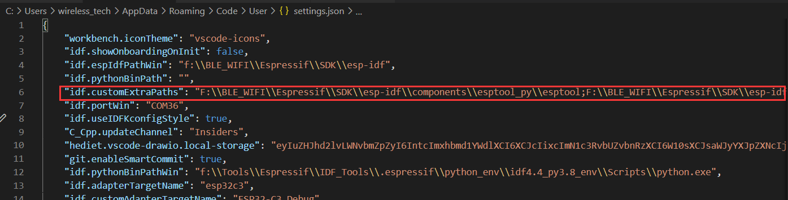

  ```json
  "idf.customExtraPaths": "F:\\BLE_WIFI\\Espressif\\SDK\\esp-idf\\components\\esptool_py\\esptool;F:\\BLE_WIFI\\Espressif\\SDK\\esp-idf\\components\\app_update;F:\\BLE_WIFI\\Espressif\\SDK\\esp-idf\\components\\espcoredump;F:\\BLE_WIFI\\Espressif\\SDK\\esp-idf\\components\\partition_table;F:\\Tools\\Espressif\\IDF_Tools\\.espressif\\tools\\riscv32-esp-elf\\esp-2021r1-8.4.0\\riscv32-esp-elf\\bin;F:\\Tools\\Espressif\\IDF_Tools\\.espressif\\tools\\cmake\\3.20.3\\bin;F:\\Tools\\Espressif\\IDF_Tools\\.espressif\\tools\\openocd-esp32\\v0.10.0-esp32-20210902\\openocd-esp32\\bin;F:\\Tools\\Espressif\\IDF_Tools\\.espressif\\tools\\ninja\\1.10.2\\;F:\\Tools\\Espressif\\IDF_Tools\\.espressif\\tools\\idf-exe\\1.0.1\\;F:\\Tools\\Espressif\\IDF_Tools\\.espressif\\tools\\ccache\\4.3\\ccache-4.3-windows-64;F:\\BLE_WIFI\\Espressif\\SDK\\esp-idf\\tools",
  ```
  
- idf.customExtraVars

  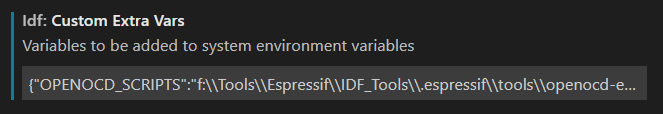

  该参数主要是配置工具包中所需要的一些自定义环境变量值，同样的你可以将自定义环境变量值添加到你电脑的系统环境中，只不过Espressif IDF插件在执行相关的操作时，是优先调用<code>idf.customExtraVars</code>中的内容，如下是小编的内容 **（请勿直接复制下述内容，其仅表示当前小编的路径，后续应随着工具的升级而做出相应的修改）**：
  ```
  {"OPENOCD_SCRIPTS":"F:/Tools/Espressif/IDF_Tools/.espressif/tools/openocd-esp32/v0.10.0-esp32-20210902/openocd-esp32/share/openocd/scripts","IDF_CCACHE_ENABLE":"1"}
  ```

  那么，这些内容又是从哪里获取呢？它们同样是从`$IDF_PATH/tools/tools.json`中获取得到，我们只需要在<code>tools.json</code>中，将<code>export_vars</code>对应的内容找出来，并填充到这个参数就可以了，以下是小编找到的内容：

  ```json
  "export_vars": {
      "IDF_CCACHE_ENABLE": "1"
    },
    "export_vars": {
      "OPENOCD_SCRIPTS": "${TOOL_PATH}/openocd-esp32/share/openocd/scripts"
    },
  ```

  其中<code>${TOOL_PATH}</code>就是对应工具包的路径，以下是小编openocd-esp32工具对应的路径内容：
  > F:/Tools/Espressif/IDF_Tools/.espressif/tools/openocd-esp32/v0.10.0-esp32-20210902

  同理，当填充完成之后，再打开全局的`Setting`，看看格式符不符合JSON格式： 

  ```json
  "idf.customExtraVars": "{\"OPENOCD_SCRIPTS\":\"F:/Tools/Espressif/IDF_Tools/.espressif/tools/openocd-esp32/v0.10.0-esp32-20210902/openocd-esp32/share/openocd/scripts\",\"IDF_CCACHE_ENABLE\":\"1\"}",
  ```

- idf.espIdfPath

  这里填充ESP-IDF的路径，但是该参数只针对Linux和Mac OS；所以，如果不是这两个系统之一，则可以不填；

- idf.espIdfPathWin

  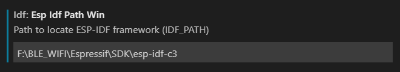

  这里填充ESP-IDF的路径，但是该参数只针对Windows系统，以下是小编的路径：
  > F:\BLE_WIFI\Espressif\SDK\esp-idf-c3

- idf.flashType

  该参数是配置下载固件时，是选择<code>UART</code>还是<code>JTAG</code>接口； **注意：ESP32-C3芯片只支持JTAG接口，不支持SWD接口**；以下是小编的配置：

  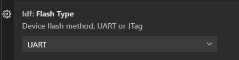


- idf.openOcdConfigs

  该参数主要是配置OpenOcd，用于下载以及调试ESP32-C3，我们需要在代码工程中的<code>settings.json</code>配置相关的参数，有两种方式：
  1. 外置的JTAG，如`Jlink`，`ESP-Prog`

      ```json
      "idf.openOcdConfigs": [    
        "board/esp32c3-ftdi.cfg"
      ]
      ```

      上述是使用外部的ESP-Prog调试仿真器的配置；
  
  1. ESP32-C3内嵌的USB-JTAG

      ```json
      "idf.openOcdConfigs": [
        "board/esp32c3-builtin.cfg"
      ]
      ```
      ESP32-C3内嵌有JTAG调试仿真器，无须额外的调试仿真器也可实现调试仿真；
- idf.port

  该参数用于选择连接ESP32C3的串口号，仅对Linux和Mac OS有效；

- idf.portWin

  该参数用于选择连接ESP32C3的串口号，仅对Windows OS有效；如果是采用JTAG下载则不需要填充该参数；

- idf.pythonBinPath

  该参数用于配置工具包中Python工具的路径，仅对Linux和Mac OS有效；

- idf.pythonBinPathWin

  该参数用于配置工具包中Python工具的路径，仅对Windows OS有效；以下是小编的路径：
  > F:\Tools\Espressif\IDF_Tools\.espressif\python_env\idf4.3_py3.9_env\Scripts\python.exe

- idf.toolsPath

  该参数用于配置工具包的路径，仅对Linux和Mac OS有效；

- idf.toolsPathWin

  该参数用于配置工具包的路径，仅对Windows OS有效；这个由于我们在安装[ESP-IDF Tools Installer](#ESP-IDF-Tools)时，就已经被添加到电脑的系统环境中了，以下是小编电脑中新添的**IDF_TOOLS_PATH**系统环境变量

  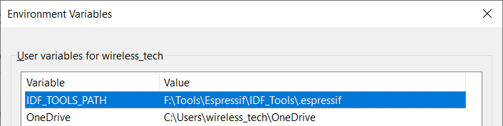

  所以，该参数的填充如下：
  > ${env:IDF_TOOLS_PATH}

除了上述提及的参数，其他的参数暂时保持默认；如有必要，再根据具体的应用做出相对应的更改。

# 实践
经过上述[开发环境搭建](#开发环境搭建)之后，如果没有配置错误，那么这个时候基本是可以在VSCODE中使用**Espressif IDF插件**的所有功能；以下小编给大家显示常见的几个功能：

## 新建一个工程
为了新建一个，我们首先打开<code>VSCODE</code>，然后按下<code>F1</code>-><code>ESP-IDF:Show Examples Projects</code>，然后选择一个你想要创建的工程，这里小编以**Blink**这个工程为例：


## 编译&下载&监控一个工程
有了工程之后，我们就可以在VSCODE中利用**Espressif IDF插件**编译、下载以及打印Log信息，这里小编还是以**Blink**这个工程为例：
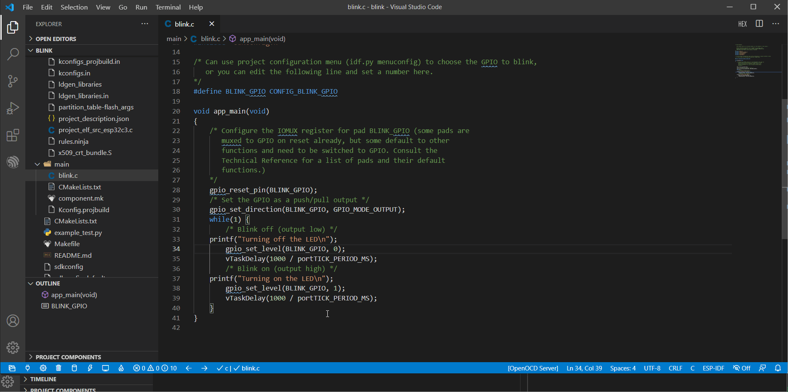

## 代码补全及函数跳转
如果我们没有进行对应的配置的话，打开一个工程会看到很多的**波浪线**以及当点击函数名时，不会发生跳转；这个时候就需要我们在代码工程中的<code>c_cpp_properties.json</code>进行配置，以下是小编的配置：

```json
{
  "configurations": [
    {
      "name": "ESP-IDF",
      "compilerPath": "${default}",
      "cStandard": "c11",
      "cppStandard": "c++17",
      "compileCommands": "${workspaceFolder}/build/compile_commands.json",
      "includePath": [
        "${config:idf.espIdfPath}/components/**",
        "${config:idf.espIdfPathWin}/components/**",
        "${workspaceFolder}/**"
      ],
      "browse": {
        "path": [
          "${config:idf.espIdfPath}/components",
          "${config:idf.espIdfPathWin}/components",
          "${workspaceFolder}"
        ],
        "limitSymbolsToIncludedHeaders": false
      }
    }
  ],
  "version": 4
}
```

其中，上述提及到的<code>compileCommands</code>，其值只有编译工程之后才会生成对应的<code>compile_commands.json</code>文件；经过上述的配置之后，此时代码补码以及函数跳转均正常，以下是小编的操作：

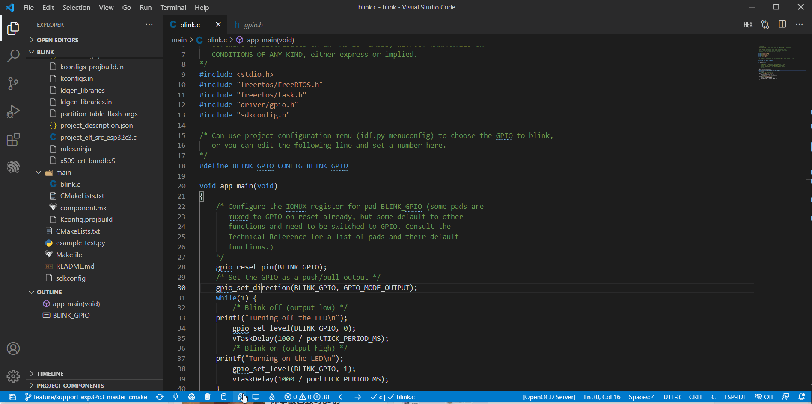

至此，所有开发必备的功能 **（包括选择串口号、GUI配置工具、单独编译及下载等功能）** 均可以直接在VSCODE中完美地运行；至于使用JTAG对ESP32C3下载以及调试，小编将会有专门一篇的内容来介绍讲解。


