# 前言
继上一章节[《基于VSCODE的ESP32C3开发环境的搭建》](./Tutorials/Basic_Chapter/基于VSCODE的ESP32C3开发环境的搭建.md)之后，小编相信大部分读者借助红旭的肩膀，应该可以轻松地搞定ESP32-C3的开发环境搭建，并完成一些基础的开发；接下来，让我们继续趁热打铁，讲讲如何利用ESP32-C3的JTAG接口，对ESP32-C3进行下载或者调试仿真。

# JTAG接口
为了更好地阐述并实现对ESP32-C3进行下载或者调试仿真，这里小编以[HX-DK-商](https://item.taobao.com/item.htm?spm=a1z10.1-c-s.w4004-22286946226.12.59ca2c2c5a3wJ3&id=654877303965)为蓝本，进行一系列的配置和讲解。


目前，ESP32-C3支持两种JTAG连接方式：
1. 内嵌的JTAG调试仿真器

    ESP32-C3内嵌了一个USB-JTAG控制器，可用于对ESP32-C3进行下载或者调试仿真，如[HX-DK-商](https://item.taobao.com/item.htm?spm=a1z10.1-c-s.w4004-22286946226.12.59ca2c2c5a3wJ3&id=654877303965)中的标号9，只要插上USB线，即可实现下载和调试仿真的功能。
1. 外置的JTAG调试仿真器

    如果想要使用外部的调试仿真器，则只要使用`标准的10-PIN连接线`与[HX-DK-商](https://item.taobao.com/item.htm?spm=a1z10.1-c-s.w4004-22286946226.12.59ca2c2c5a3wJ3&id=654877303965)中的标号8相连接，即可实现对ESP32-C3的下载和调试仿真。

## <span id ="USB-SERIAL-JTAG">内置的USB-SERIAL-JTAG</span>
ESP32-C3不但内置了`USB-JTAG`，还内置了`USB-SERIAL`，这给开发者提供了大大的便利，仅需要一根USB线即可实现下载和调试仿真，**实乃众多半导体厂商中的第一芯**。但是它们始终属于ESP32-C3中的一个外设，一旦设备进入休眠又或者死机了又或者重启了，那么这个外设的功能也随着 **"废掉"** 了，但是如果没有这些问题的话，那还是省心省力的，这是目前内置USB-SERIAL-JTAG的局限性所在。所以，[HX-DK-商](https://item.taobao.com/item.htm?spm=a1z10.1-c-s.w4004-22286946226.12.59ca2c2c5a3wJ3&id=654877303965)仍然保留了外置的USB-SERIAL和调试仿真器。

在使用内置的USB-SERIAL-JTAG功能之前，用户还需要安装相应的驱动，这个驱动在上一章节[《基于VSCODE的ESP32C3开发环境的搭建》](./Tutorials/Basic_Chapter/基于VSCODE的ESP32C3开发环境的搭建.md)中提及的`ESP-IDF-Tools`工具中可以获取得到，即使用ESP-IDF-Tools安装相应的配置工具包时，要勾选`idf_driver`。最后，用户就可以在`.espressif`文件夹找到它，如下图所示：

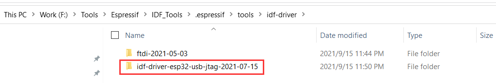

如果驱动安装成功，当[HX-DK-商](https://item.taobao.com/item.htm?spm=a1z10.1-c-s.w4004-22286946226.12.59ca2c2c5a3wJ3&id=654877303965)中的标号9只要插上USB线，在设备管理器中就可以发现一个`虚拟的串口`和一个`USB-JTAG的接口`，如下所示：

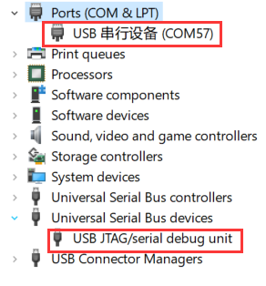

这个时候，用户就可以利用内置的USB-SERIAL-JTAG对ESP32-C3进行下载和调试。

### 下载
ESP32-C3的固件下载有两种方式：
1. UART下载

    因为内置有USB-SERIAL且驱动也已经安装成功，那么用户只需要在VS CODE上进行简单地配置即可下载：
    
    1. 在VSCODE状态栏左下方，选择内置USB-SERIAL的虚拟串口

        

    1. 在ESP-IDF插件设置中，选择串口方式下载固件

        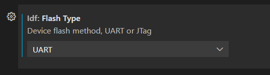
        
    1. 在VSCODE状态栏左下方，选择芯片的型号

        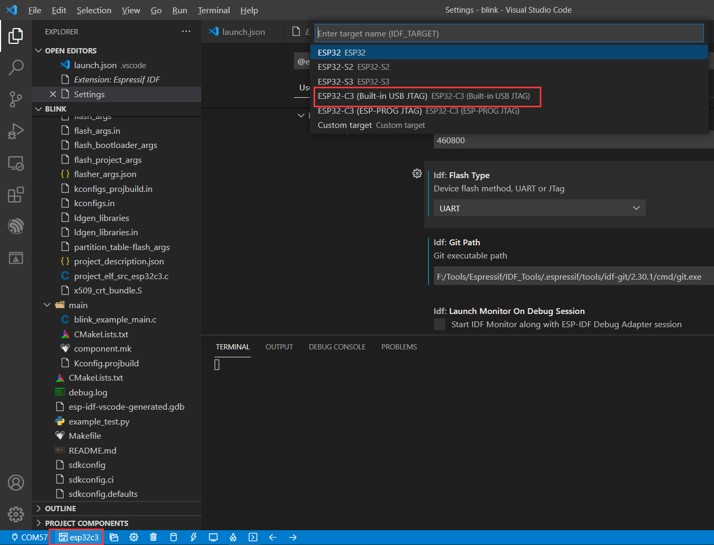

  当上述的配置设置完成之后，即实现内置的USB-SERIAL对ESP32-C3进行下载，如下所示：
  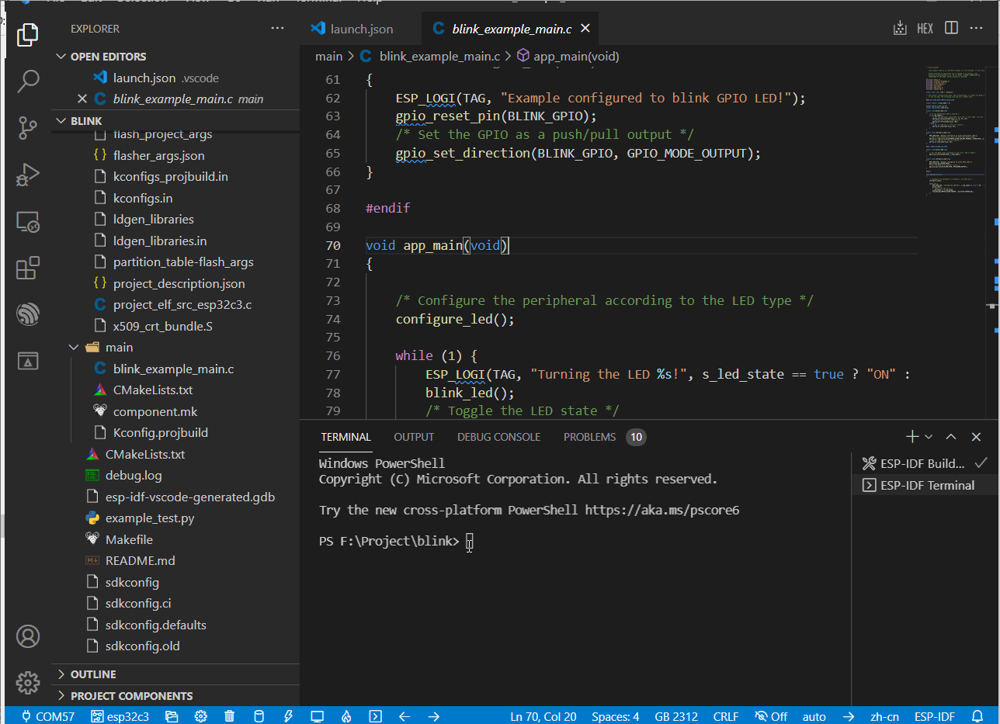

1. JTAG下载

    同理，用户只需要在VS CODE上进行简单地配置即可：

    1. 在ESP-IDF插件设置中，选择JTAG方式下载固件

        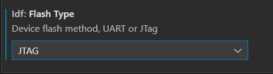
        
    1. 在VSCODE状态栏左下方，选择芯片的型号

        

  当上述的配置设置完成之后，即实现内置的USB-JTAG对ESP32-C3进行下载，如下所示：
  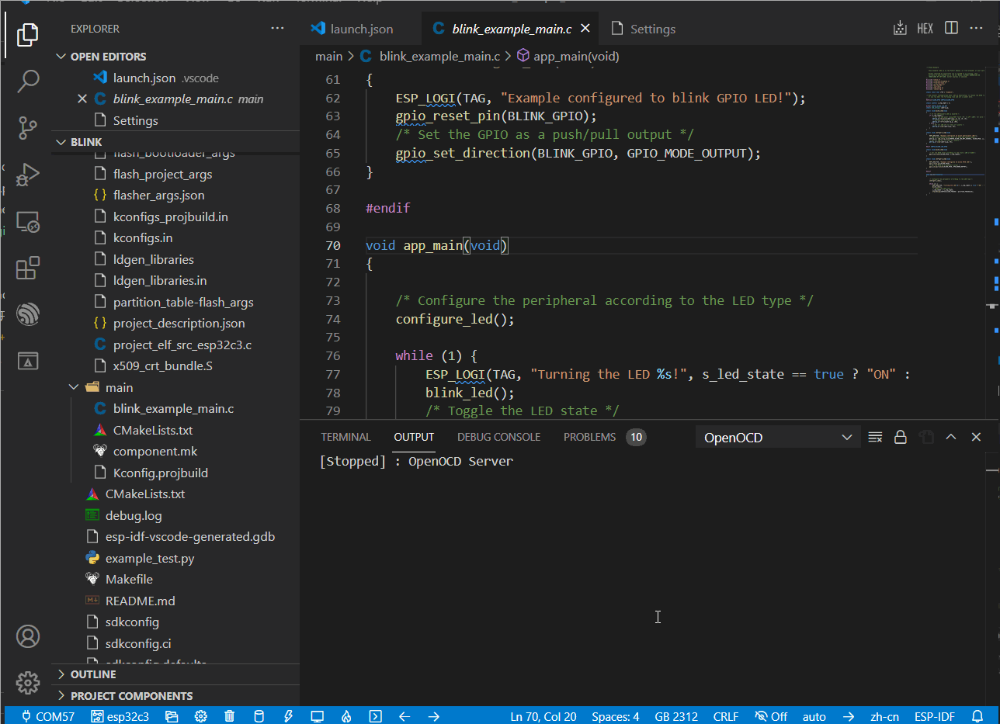

### 调试仿真
到目前小编写下这篇文章为止，基于`VSCODE`+`ESP-IDF插件`+`ESP-IDF`的方式，对ESP32-C3进行调试仿真，已经相对比较稳定可靠了；之所以这篇文章这么难产，是因为前期各个方面有太多的Bug，消耗了小编大量的时间，如果有读者在官方的Github仓库查询ESP32-C3 Debug问题的话，基本上大部分都是小编我发的Ticket。好了，废话不多说，想要使用内置的USB-JTAG对ESP32-C3进行调试仿真，需要如下2个步骤：

1. 同样的，在VSCODE状态栏左下方，选择芯片的型号，即：


1. 配置当前代码工程的`launch.json`文件为下述的内容：
```json
{
  "version": "0.2.0",
  "configurations": [
    {
      "type": "espidf",
      "name": "Launch-name",
      "request": "launch",
      "mode": "auto",
      "skipVerifyAppBinBeforeDebug": true
    }
  ]
}
```

当上述的配置设置完成之后，为了保证调试仿真的鲁棒性，请先用上述的`JTAG下载`的方法先下载固件 **（如果固件没有更新，一次即可；如果有更新，则务必再下载一次）**，然后再按下`F5`键，即可实现内置的USB-JTAG对ESP32-C3进行调试仿真，如下图所示：
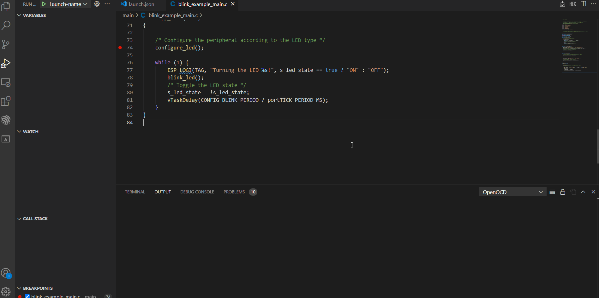

> 如果突然间出现无法调试仿真的情况，先用上述的`JTAG下载`的方法先下载固件，紧接着硬件复位一下ESP32-C3，然后再按下`F5`键进行调试仿真。

## 外置的ESP-Prog
如上述的**内置的USB-SERIAL-JTAG**内容所述，内置的USB-SERIAL-JTAG控制器仍然存在一些瑕疵，所以有的应用场景仍然需要外部的调试仿真器来下载以及调试仿真。


同理，外置的ESP-Prog在使用之前，也是需要安装驱动文件的，其方法也跟内置的USB-SERIAL-JTAG的相似，即在上一章节[《基于VSCODE的ESP32C3开发环境的搭建》](./Tutorials/Basic_Chapter/基于VSCODE的ESP32C3开发环境的搭建.md)中提及的`ESP-IDF-Tools`工具中可以获取得到，即使用ESP-IDF-Tools安装相应的配置工具包时，要勾选`idf_driver`。最后，用户就可以在`.espressif`文件夹找到它，如下图所示：


如果驱动安装成功，ESP-Prog只要插上USB线，在设备管理器中就可以发现一个`虚拟的串口`和一个`USB-JTAG的接口`，如下所示：

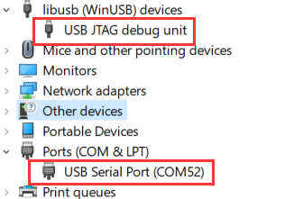

这个时候，用户就可以利用外置的ESP-Prog对ESP32-C3进行下载和调试。还有一点需要注意的是：当ESP Prog与[HX-DK-商](https://item.taobao.com/item.htm?spm=a1z10.1-c-s.w4004-22286946226.12.59ca2c2c5a3wJ3&id=654877303965)的标号8相连接时，请**将ESP Prog的`JTAG_PWR_SEL`拨到5V，然后`HX－DK－商开发板`什么线都不需要接**。

### 下载
由于ESP Prog调试仿真器也具备USB-JTAG和USB-SERIAL的功能，所以其也支持两种方式的下载：

1. UART下载

    这种方式比较简单，只需要将对应的TX和RX相互连接即可；至于ESP Prog的TX、RX引脚详情，请参考[ESP Prog官方的介绍](https://docs.espressif.com/projects/espressif-esp-iot-solution/en/latest/hw-reference/ESP-Prog_guide.html?highlight=esp%20prog)，因为这种方式大同小异，小编就不再细述。
1. JTAG下载

    如果使用外置ESP-Prog的JTAG接口对ESP32-C3进行下载，用户还需要对ESP32-C3内部的eFuse进行设置 **（注意，该设置是永久的，不可恢复的）**，即需要使用`espefuse.py`对eFuse的`JTAG_SEL_ENABLE`位进行烧录，操作的命令如下：
    ```c
    F:/Tools/Espressif/IDF_Tools/.espressif/python_env/idf4.4_py3.8_env/Scripts/python.exe F:\BLE_WIFI\Espressif\SDK\esp-idf-c3\components\esptool_py\esptool\espefuse.py -p COM50 burn_efuse JTAG_SEL_ENABLE 1
    ```
    上述是小编当前的`Python`和`espefuse.py`路径和`COM口`，不同的用户可能对应的路径些许不同。当按照上述的命令配置之后，ESP32-C3在复位时，会根据GPIO10的电平来判断使用内置USB-JTAG还是外置的JTAG调试仿真器：
    - GPIO10为低电平时，使用内置的USB-JTAG
    - GPIO10为高电平时，使用外置的JTAG调试仿真器

    **但是！！！目前这个功能截止目前为止还有Bug，只能通过下一版的硬件升级才能解决这个问题；当前的现状就是只要烧录了JTAG_SEL_ENABLE位，ESP32-C3就永远只能支持外置的JTAG调试仿真器了**

    紧接着，我们就可以进行JTAG烧录了，即：
    1. 在ESP-IDF插件设置中，选择JTAG方式下载固件

        
        
    1. 在VSCODE状态栏左下方，选择芯片的型号

        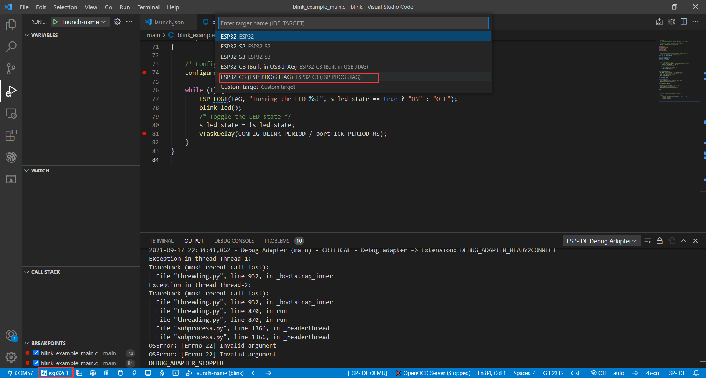

  当上述的配置设置完成之后，即实现外置的ESP Prog对ESP32-C3进行下载，如下所示：
  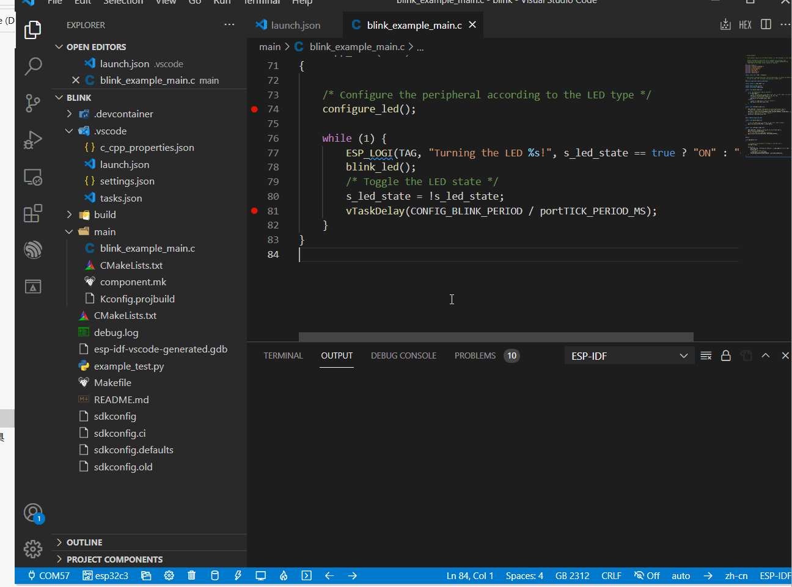

### 调试仿真
同理，使用外置ESP Prog调试仿真器的设置，与使用内置的USB－SERIAL－JTAG是一样的；唯一不同的是：**只不过当选择设备类型时，要选择`ESP32-C3(ESP-PROG JTAG)`** ；小编这里也不再过多地描述，下图是使用外置ESP Prog调试仿真器的动图：
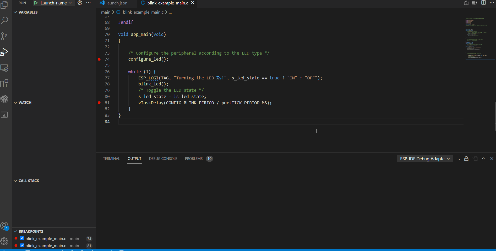

至此，如何基于JTAG接口对ESP32-C3进行下载及调试仿真已经讲解完毕。